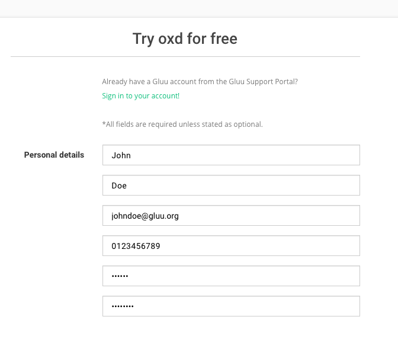
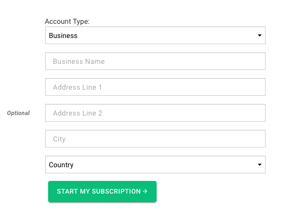
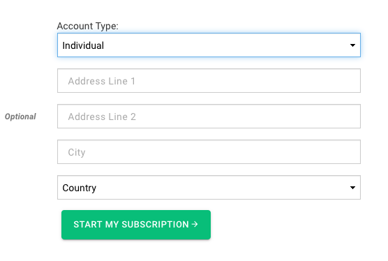
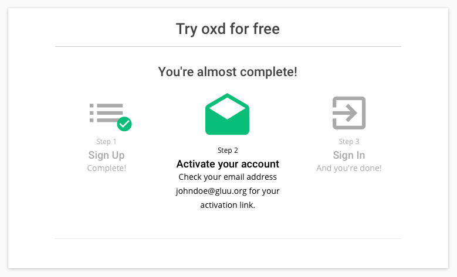

# Signup
To signup for your oxd license visit [Registeration](https://oxd.gluu.org/register) page and fill in your details to 
create an account.

Enter your personal information and choose an account type. 
There are two types of accounts, Business accounts and individual accounts.

#### Business account
If you are signing up on behalf of a business, please select the 'Business' account type 
and enter the official name and the physical address of your business.

#### Individual
If you are signing up to use oxd personally, please select the 'Individual' 
account type and enter your physical address.

After filling the form, an message will be sent to your email address for 
verification of your email. Click on the link included in the email to activate 
your account and take you to your [dashboard](../../dashboard/index.md).

