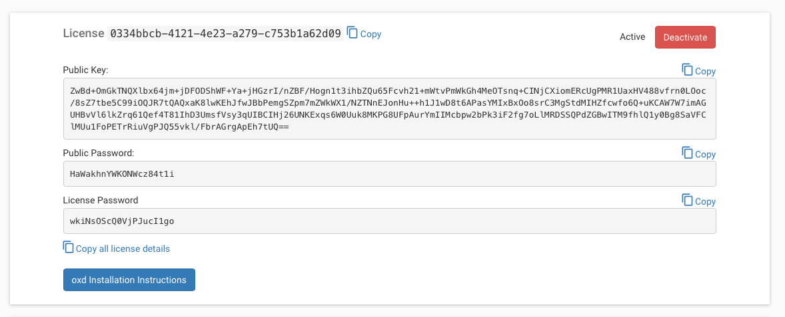
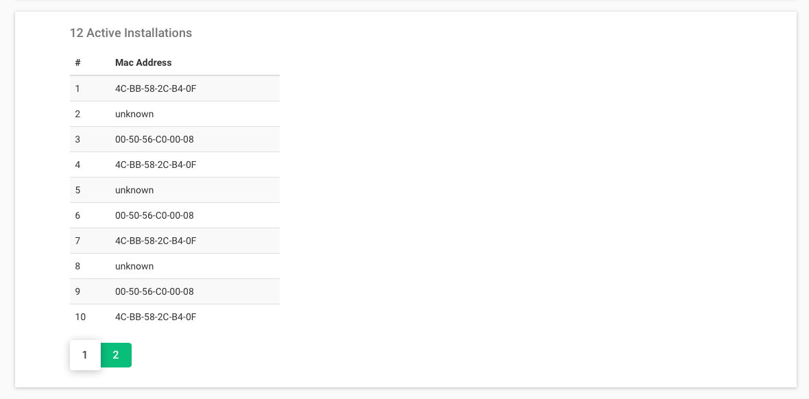
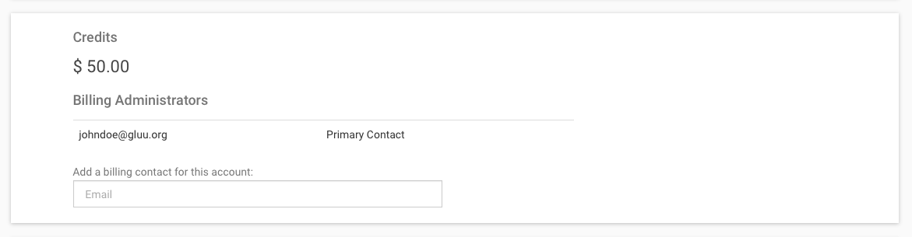
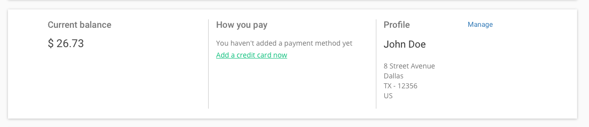
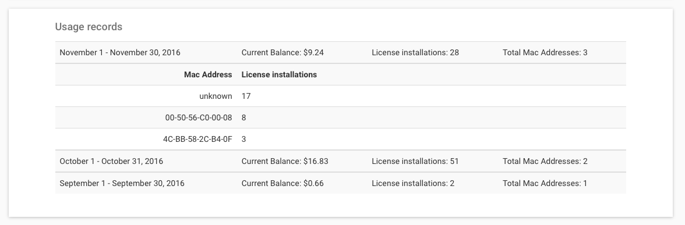
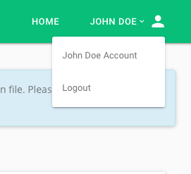

# Dashboard

## License Information
The first part of the dashboard contains your oxd license details. Click `copy all license details` to copy all three pieces of information in a key-value pair or click on the individual keys to copy them. You will need to add your license details to your oxd configuration file in order to start the oxd server. 

If at any time you want to deactivate your license and all your active oxd installations, you can deactivate and reactivate your license by clicking on the button at the top right hand corner.

## Active Installations
This section of the dashboard shows the servers that have current oxd installations. Each time oxd is installed, the MAC address of the server is recorded and used to identify the server.  

## Billing Administrators

This is a list of all users with access to your license account. You can invite new users as billing administrators in the invite users field. Just enter an email address and press enter to send them an invitation. An invite will be sent to their email prompting them to register and join your oxd account as a billing administrator.

## Profile and Payment Info
This section is divided into three parts:

- **Current balance**: Your current unpaid balance to be billed on the 7th of the following month. Click [here](../billing/index.md) for more information on oxd billing.    

- **How you pay**: A summary of your credit card information is shown here. You can [add a card](../payments/add/index.md) if you haven't already.   

- **Profile**: Your name and billing address can be found here. Click on [manage](../profile/index.md) to view and change your billing address.   

## Usage Records:

This is a monthly record of your oxd servers and how many days of usage has been logged on each of them.

## Change Account:
If you have been invited as a billing administrator for other oxd accounts, click on the account name at the top right corner of the page to switch accounts.

