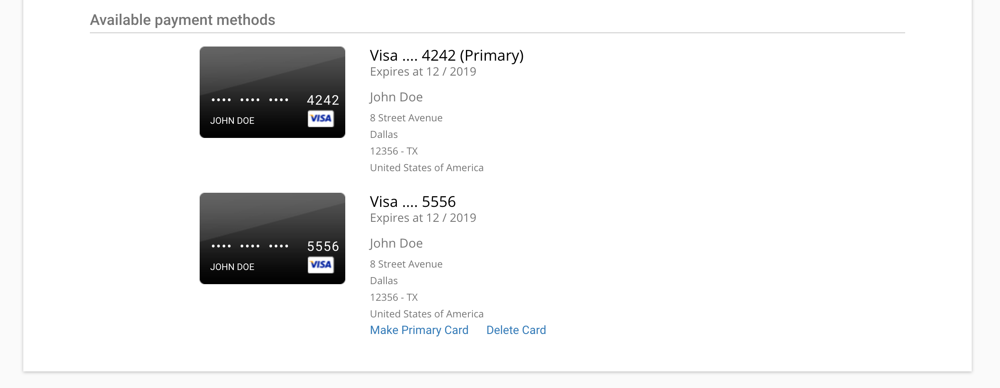

###Change Primary Card
Each month, your primary credit card is charged for your oxd usage. To set another card as 
your primary credit card click on the `Make Primary Card` link for the card you wish to 
make your primary credit card.

###Delete Card
To delete a credit card, click on the `Delete Card` link. Be careful as this action 
is not reversible. You can always add a credit card you deleted back to your list of 
credit cards by clicking on `Add a new payment method`
