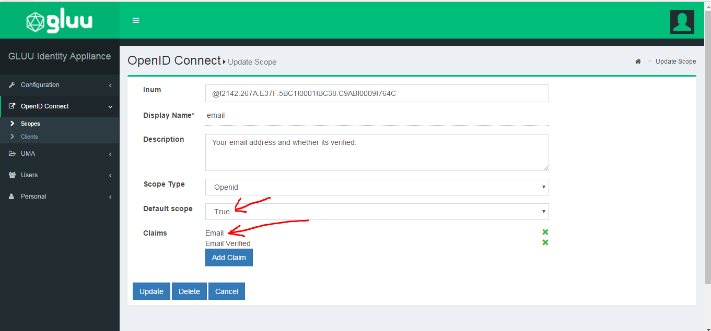

# OpenID Connect Single Sign-On (SSO) WordPress Plugin By Gluu

The oxd OpenID Connect single sign-on (SSO) plugin for WordPress enables you to authenticate and enroll users for a WordPress site with a standard OpenID Connect Provider (OP), like Google or the [Gluu Server](https://gluu.org/docs/ce/installation-guide/install/). 

## WordPress Demo Video

You can watch a video demo of the WordPress plugin installation and configuration [here](https://youtu.be/RfDrhGQ185M).

## Requirements
In order to use the WordPress plugin you will need a WordPress site, a standard OP (like Google or a Gluu Server), and an active oxd server. Some additional notes:

* This plugin is compatible with WordPress versions: 2.9 - 4.7.2.

* If you want to stand up your own OP server, you can deploy the free open source [Gluu Server](https://gluu.org/docs/ce/3.0.1/installation-guide/install/). Otherwise we recommend using Google as the OP. 

* You will need a valid license to start the oxd server. You can get a license and a $50 credit by signing up on the [oxd website](https://oxd.gluu.org). 

## Plugin Installation
 
### Download the Plugin

You can either download the plugin from the [Github source](https://github.com/GluuFederation/wordpress-oxd-plugin/archive/v2.4.4.zip) or the [WordPress marketplace](https://wordpress.org/plugins/openid-connect-sso-by-gluu/).

### Upload the Plugin
Navigate to the WP-admin portal of your WordPress site and open the plugin page, e.g. `https://{site-base-url}/wp-admin/plugin-install.php?tab=upload`. Upload the plugin and click the install now button.

### Activate the Plugin

Activate the plugin by performing the following steps:
 
1. Go to `https://{site-base-url}/wp-admin/plugins.php`
2. Find OpenID Connect Single Sign-On (SSO) Plugin By Gluu and click the activate button.

## Plugin Configuration 

In your WordPress admin menu panel you should now see the OpenID Connect tab in the lefthand menu. Click the link to navigate to the General configuration page.

### General

#### Server Settings
In the server settings section of the plugin configuration page you will need to enter some information about your OP, your oxd server, and where you want users to be redirected after logout. 

A short description of each field follows:

1. URI of the OpenID Provider: Insert the URI of the OpenID Connect Provider here. If you are using Google as your OP, this will simply be `https://accounts.google.com`. If you are using another OP, it will be something like `https://idp.example.com`. 

2. Custom URI after logout: Insert a link to where you want users to land once they log out of the WordPress site, for instance `https://example.com/thank-you`. If you don't have a set page, we recommend simply entering the URL of your website homepage. If you leave this field blank the user will see the default logout page presented by WordPress. 

3. oxd port: Enter the oxd-server port, which you can find in your `oxd-server/conf/oxd-conf.json` file.

4. Click `Register` to continue.

If your OpenID Provider supports dynamic registration no additional steps are required. 

If your OpenID Connect Provider does not support dynamic registration (like Google), after clicking register two additional fields will be exposed where you need to enter your `client_id` and `client_secret`. 

Both values need to be obtained from the OP. To generate your `client_id` and `client_secret` use the redirect uri: `https://{site-base-url}/index.php?option=oxdOpenId`.

!!!Note:
    If you are using a Gluu server as your OpenID Provider, you can make sure everything is configured properly by logging into to your     Gluu Server, navigate to the `OpenID Connect` > `Clients` page. Search for your `oxd id`.

#### Enrollment and Access Management
In the enrollment and access management section of the plugin configuration page you can decide, (1), how new user registration will be handled, and, (2), what role new users will receive upon registration.

1. You have three options for choosing how new user registrations will be handled: 

- Automatically register any user with an account in the OpenID Provider: By setting registration to automatic, any user with an account in the OP will be able to dyanmically register for an account on your WordPress site;

- Only register and allow ongoing access to users with one or more of the following roles in the OP: Using this option you can limit registration to users that have a specified role in the OP, for instance `wordpress`. Note: this is not configurable in all OP's. It is configurable if you are using a Gluu Server. [Follow the instructions below](#role-based-enrollment) to limit access based on an OP role. Each time the user authenticates they will need to present this scope for access (i.e. if you remove this scope from the users profile in the OP, the user will be denied access); 

- Disable automatic registration: if you choose to disable automatic registration, you will need to manually add a user for each person you want to provision access to the WordPress site. Make sure that when you add the user in WordPress, you use the same email that they have registered in the OP. 

2. New User Default Role: specify which role to give to new users upon registration.  

#### Role Based Enrollment
In order to enable role based enrollment, perform the following: 

1. Navigate to your Gluu Server admin GUI ("oxTrust"); 
2. Click the `Users` tab in the left hand navigation menu; 
3. Select `Manage People`;  
4. Find the person(s) who should have access;   
5. Click their user entry;   
6. Add the `User Permission` attribute to the person and specify the same value as in the plugin. For instance, if in the plugin you specify that enrollment should be limited to users with role = `wordpress`, then you should also have `User Permission` = `wordpress` in the user entry. [See a screenshot example](https://cloud.githubusercontent.com/assets/5271048/19735932/2c3817c4-9b73-11e6-9d59-ace7ecdfed41.png).
7. Update the user record. 
8. Go back to the WP plugin and navigate to the OpenID Configuration tab. 
9. In the User Scopes section, check the box for `permission`.  
10. Now users with the specified scope are ready for enrollment at your WordPress site. 

### OpenID Connect Configuration
Navigate to the OpenID Connect Configuration tab to set Scopes and Authentication decisions. 

#### User Scopes

Scopes are groups of user attributes that are sent from the OP to the application during login and enrollment. By default, the requested scopes are `profile`, `email`, and `openid`.  

To view your OP's available scopes, open a web browser and navigate to `https://<hostname>/.well-known/openid-configuration`. For example, here are the scopes you can request if you're using [Google as your OP](https://accounts.google.com/.well-known/openid-configuration). 

If you are using a Gluu server as your OpenID Provider, you can also view available scopes by navigating to `OpenID Connect` > `Scopes` in the Gluu Server Admin UI  ("oxTrust").

#### Authentication
In the authentication settings, you have a couple options:

1. Bypass the local WordPress login page and send users straight to the OP for authentication: If you would like to send users straight to the OP for login, and bypass WordPress's local login page, check this box. When this option is left unchecked, users will see the following screen when trying to login: 

 

2. Select ACR: `acr` is a value described in the OpenID Connect specification. It stands for Authentication Context Class Reference. Using ACR's, applications can request certain types of authentication made available by the OP, e.g. SMS based two factor authentication, or FIDO U2F tokens. This allows applications to explicitly request stronger forms of authentication. If you are using Google as your OP, you will have to accept whatever authentication mechanism they use for authentication. If you are using a Gluu Sever as the OP, you will be able to request any additional forms of authentication supported. You can navigate to your OpenID Provider configuration webpage `https://<hostname>/.well-known/openid-configuration` to see supported `acr_values`. 

In the `Select acr` section of the plugin page, choose the mechanism which you want for authentication. If the `Select acr` value in the plugin is `none`, users will be sent to pass the OP's default authentication mechanism.

## OP Configuration

### Gluu Server Configuration 

If you are using a Gluu Server as your OP, you will need to configure Gluu to release the email claim. You can do so by following the below steps:

1. Log in to your Gluu Server dashboard ("oxTrust") and navigate to `OpenID Connect` > `Scopes`. 

2. Find the `email` scope and click on it. 

3. Set the default scope field to `True`.

4. If `Email` is not already added to the `Claims` field, click the `Add Claim`, search for email, and add it. 

5. Now navigate to `Configuration` > `Attributes` and make sure that the `Email` attribute is set to `Active`. If it is not, click on the `email` attribute and scroll down to the `Status` field where you can change the value to Active. Click update. 

## Support
Please report technical issues and suspected bugs on our [support page](https://support.gluu.org). If you do not already have an account on Gluu Support, you can login and create an account using the same credentials you created when you registered for your oxd license.
