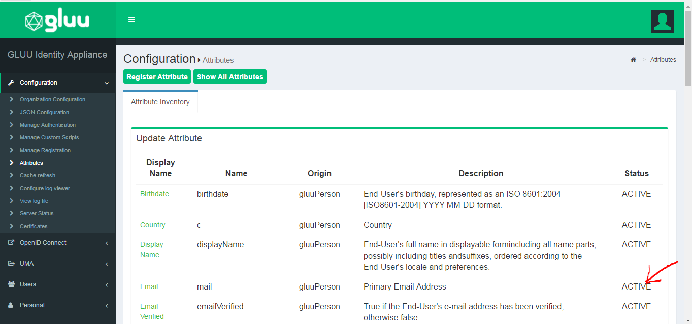
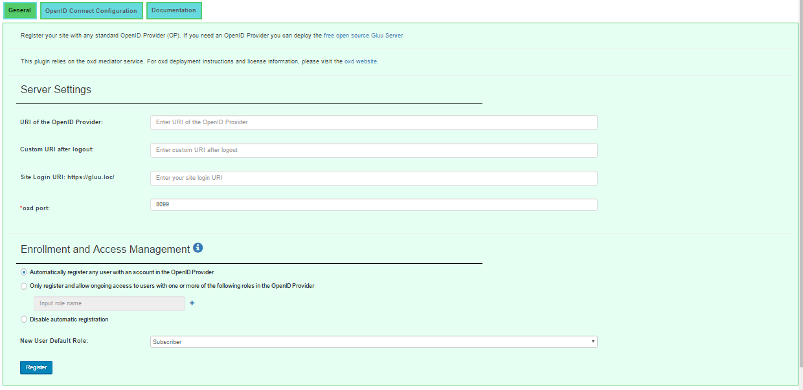
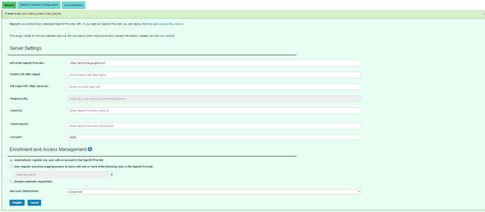

## Configuration

### Gluu Server Configuration 

Before using this plugin with GLUU open id provider make sure you have configured gluu to return email claim.

To enable email claim in the gluu server do the following:

1.First navigate to `OpenID Connect` > `Scopes` in the `Display Name` column click the `Email` link and then set the default scope to `True` from the drop down menu and make sure to add email claim in the `claims menu`(see following images for better reference).

2.Then navigate to `Configuration` > `Attributes` and make sure that the `Email` row is set to `Active` in the scopes.

### General 

In your WP(WordPress) admin menu panel you should now see the OpenID Connect menu tab. Click the link to navigate to the General configuration  page:

 

1. Automatically register any user with an account in the OpenID Provider: By setting registration to automatic, any user with an account in the OP will be able to register for an account in your WordPress site. They will be assigned the new user default role specified below.
2. Only register and allow ongoing access to users with one or more of the following roles in the OP: Using this option you can limit registration to users who have a specified role in the OP, for instance `wordpress`. This is not configurable in all OP's. It is configurable if you are using a Gluu Server. [Follow the instructions below](#role-based-enrollment) to limit access based on an OP role. 
3. New User Default Role: specify which role to give to new users upon registration.  
4. URI of the OpenID Provider: insert the URI of the OpenID Connect Provider.
5. Custom URI after logout: custom URI after logout (for example "Thank you" page).
6. oxd port: enter the oxd-server port (you can find this in the `oxd-server/conf/oxd-conf.json` file).
7. Click `Register` to continue.

If your OpenID Provider supports dynamic registration, no additional steps are required in the general tab and you can navigate to the [OpenID Connect Configuration](#openid-connect-configuration) tab. 

If your OpenID Connect Provider doesn't support dynamic registration, you will need to insert your OpenID Provider `client_id` and `client_secret` on the following page.

 

To generate your `client_id` and `client_secret` use the redirect uri: `https://{site-base-url}/index.php?option=oxdOpenId`.

!!!Note:
    If you are using a Gluu server as your OpenID Provider, you can make sure everything is configured properly by logging into to your     Gluu Server, navigate to the `OpenID Connect` > `Clients` page. Search for your `oxd id`.
