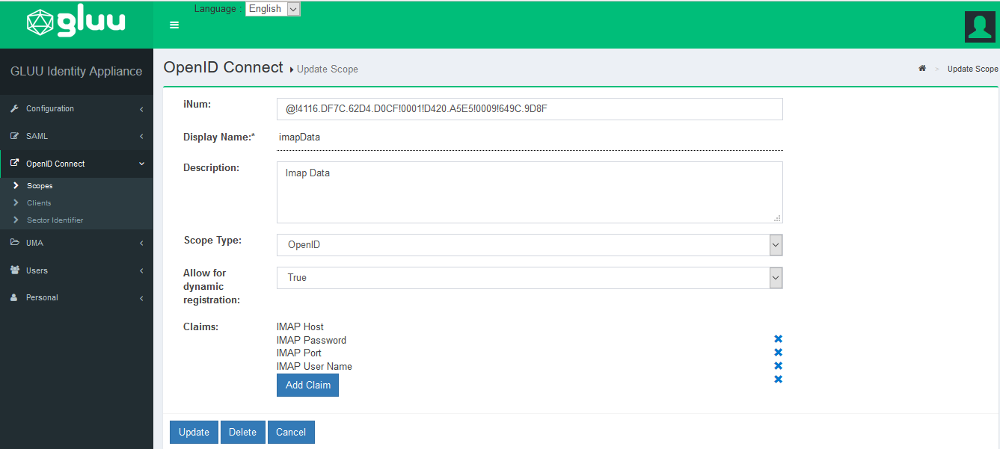
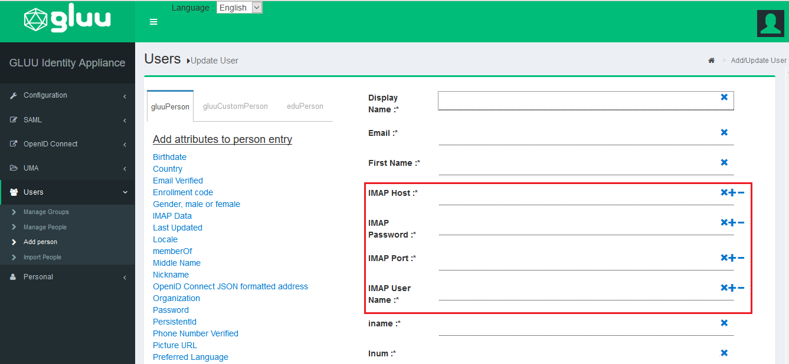
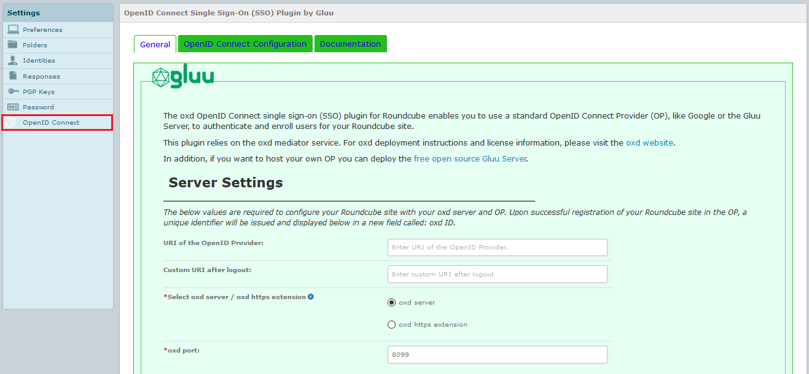
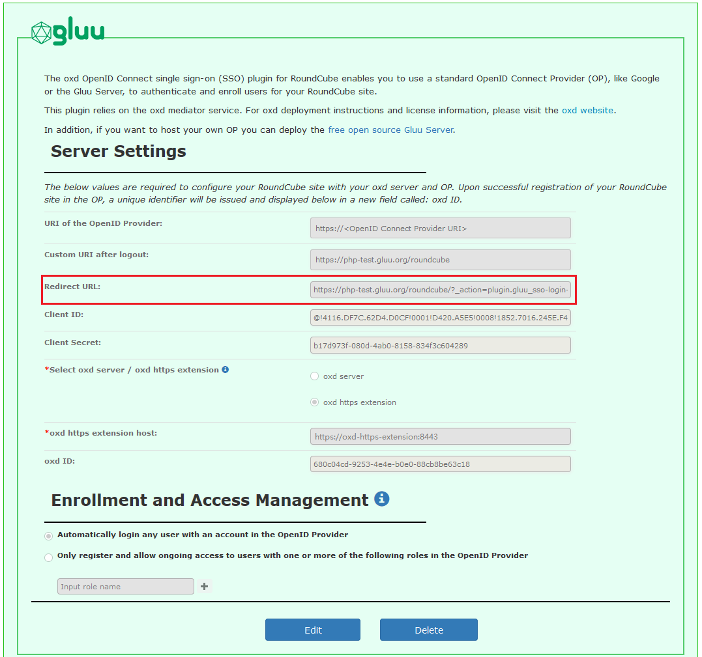
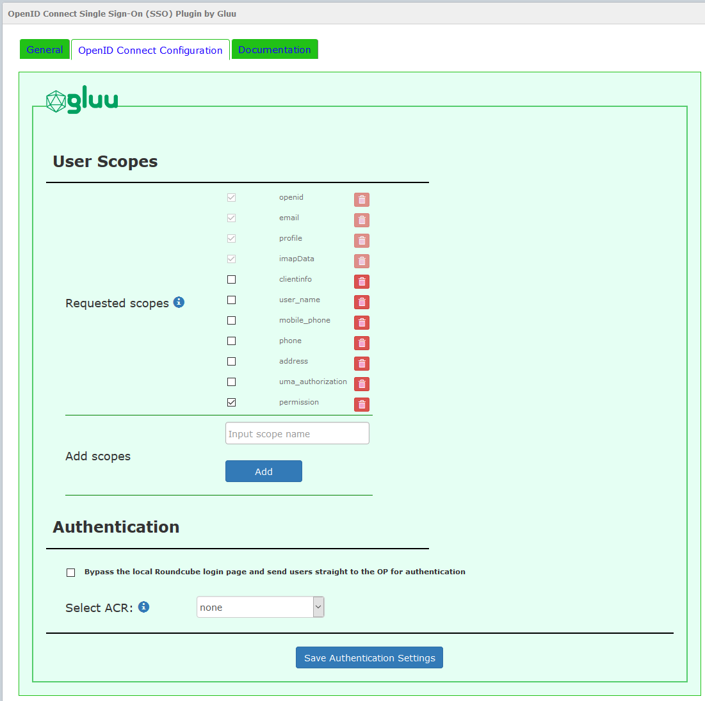
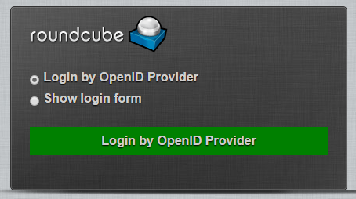

# RoundCube OpenID Connect Single Sign-On (SSO) Plugin By Gluu


The oxd OpenID Connect single sign-on (SSO) plugin for RoundCube enables you to use a standard 
OpenID Connect Provider (OP), like Google or the [Gluu Server](https://gluu.org/docs/ce/installation-guide/install/), 
to authenticate and enroll users for a RoundCube site. 

## Requirements
In order to use the Roundcube Extension you will need 
a Roundcube site, standard OP (like Google or a Gluu Server) and an active oxd server. Some additional notes:

- This plugin is compatible with RoundCube Versions : 0.6.0 <= 1.3.3

-  If you prefer to have your own OP server, you can deploy the free open source [Gluu Server](https://gluu.org/docs/ce/3.1.1/installation-guide/install/).

- You will need a valid license to start the oxd server. You can get a license and a $50 credit by 
signing up on the [oxd website](https://oxd.gluu.org).

!!! Note
    Here standard OpenID Connect provider means the Gluu Server, because Google OpenID Connect provider is not supported in `RoundCube` plugin.

## Installation
 
### Download

You can download the plugin from [Github source](https://github.com/GluuFederation/roundcube_oxd_plugin/archive/v3.1.1.zip).

[Link to RoundCube repository](https://plugins.roundcube.net/packages/gluufederation/roundcube_oxd_plugin)

To install `RoundCube` OpenID Connect Single Sign On (SSO) Plugin By Gluu via Composer, execute the following command 

```
$ composer require "gluufederation/roundcube_oxd_plugin": "3.1.1"

```

## Gluu Server customization for RoundCube plugin

#### IMAP Scopes

For doing login to your RoundCube site, it is very important that your OpenID Connect provider supports `imapData` scope, which contains your imap connection claims (`imapHost`,`imapPort`,`imapUsername`,`imapPassword`).
This is not configurable in all OpenID Connect provider's. It is configurable if you are using a Gluu Server.
For example : `imapHost` = `ssl://imap.email.com` ; `imapPort` = `993` ; `imapUsername` = `username@email.com` ; `imapPassword` = `password` ; 

All these scopes are to be added with the help of this following link `https://gluu.org/docs/ce/admin-guide/attribute/`

#### Navigation steps

Navigate to your Gluu Server admin GUI. Click the `OpenID Connect` tab in the left hand navigation menu. Select `Scopes`. Find `imapData` and click on it. Now click `Add Claim`, search for `IMAP`, select the required claims and then click `OK`.

 

Once you add the required claim, then you need to assign claim values (IMAP Host, IMAP Password, IMAP Port, IMAP User Name) to the user. 




## Configuration

### General
 
For the first time configuration, after logging in as `admin`(for example : `admin@email.org`), you should now see your RoundCube admin menu panel and the OpenID Connect menu tab. Click the link to navigate to the General configuration page:

!!! Note
    To configure oxd-server Roundcube plugin you need to login as admin@yourdomain.com . This is done to prevent other user to edit oxd-server plugin settings.

 


A short description of each field follows:

1. URI of the OpenID Provider: insert the URI of the OpenID Connect Provider, for example : `https://idp.example.com`. 

2. Custom URI after logout: Provide a URL for a landing page to redirect users after logout of the RoundCube site, for instance `https://roundcube.email.com/Logout`. If you don't have a preferred logout page we recommend simply entering your website homepage URL. If you leave this field blank the user will see the default logout page presented by RoundCube.

3. `oxd server`: Enter the oxd-server port, which you can find in your `oxd-server/conf/oxd-conf.json` file. The default port no is 8099

   `oxd https extension` : Enter the oxd-https-extension host, if you are using oxd-https-extension.

4. Click `Register` to continue.

  

!!! Note
    If you are using a Gluu server as your OpenID Provider, you can make sure everything is configured properly by logging into to your Gluu Server, navigate to the OpenID Connect > Clients page. Search for `Roundcube`.

#### User Scopes

Navigate to your Gluu Server admin GUI. Click the `Users` tab in the left hand navigation menu. Select `Manage People`. Find the person(s) who should have access. Click their user entry. Add the `User Permission` attribute to the person and specify the same value as in the plugin. For instance, if in the plugin you have limit enrollment to user(s) with role = `roundcube`, then you should also have `User Permission` = `roundcube` in the user entry. Update the user record, and now they are ready for enrollment at your Roundcube site. For admin access you can set `User Permission` = `admin`


### OpenID Connect Configuration

 

#### Enrollment and Access Management

Scopes are groups of user attributes that are sent from the OpenID Connect provider to the application during login and enrollment. By default, the requested scopes are `profile`, `imapData`, `email`, and `openid`.  

To view your OpenID Connect provider's available scopes, in a web browser navigate to `https://OpenID-Provider/.well-known/openid-configuration`.  

If you are using a Gluu server as your OpenID Provider, 
you can view all available scopes by navigating to the Scopes interface in Gluu CE Server Admin UI

`OpenID Connect` > `Scopes`  

In the plugin interface you can enable, disable and delete scopes. 

!!! Note
    If you have chosen to limit enrollment to users with specific roles in the OP, you will also need to request the `Permission` scope, as shown in the above screenshot. 

#### Authentication

##### Bypass the local RoundCube login page and send users straight to the OpenID Connect provider for authentication


1. Bypass the local RoundCube login page and send users straight to the OP for authentication: Check this box so that when users attempt to login they are sent straight to the OP, bypassing the local RoundCube login screen. When it is not checked, users will see the following screen when trying to login:  
 

2. Select ACR: `acr` is an OpenID Connect specific value that enables applications to request a 
specific type of authentication from the OP, e.g. SMS based two factor authentication, or FIDO U2F tokens. 
If you are using Google as your OP, you will have to accept their default authentication mechanism. 
If you are using a Gluu Sever, you will be able to request any supported form of authentication. 
To view the OP's supported ACR values, navigate to your OpenID Provider configuration page, 
`https://<hostname>/.well-known/openid-configuration` and find `acr_values`. In the `Select acr` 
field you can choose your preferred authentication mechanism. If `Select acr` is `none`, users will be 
sent to pass the OP's default authentication mechanism.


## Support
Please report technical issues and suspected bugs on our [support page](https://support.gluu.org). If you do not already have an account on Gluu Support, you can login and create an account using the same credentials you created when you registered for your oxd license.