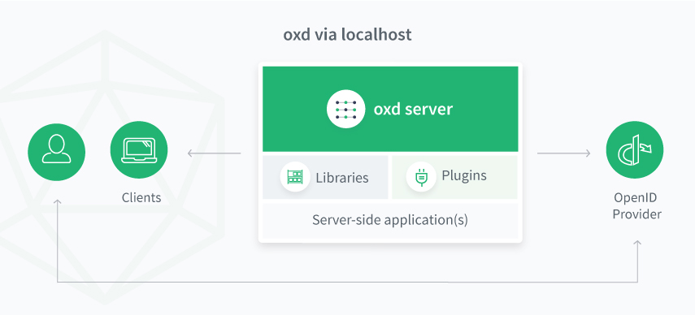
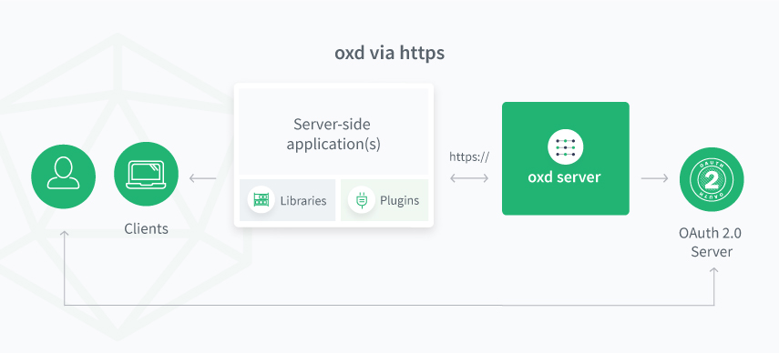

# oxd 3.1.2 Documentation

## Introduction
oxd exposes simple, static APIs web application developers can use to securely implement user authentication and authorization against an OAuth 2.0 identity provider (IDP) like the [Gluu Server](https://gluu.org/docs/ce).

The oxd software package includes the `oxd-server` and the `oxd-https-extension`: 

- `oxd-server` is designed to work as a standalone service daemon via sockets. API calls to oxd-server must come via localhost.

 

- `oxd-https-extension` is an optional component, that when enabled, allows apps to call oxd APIs over the web. 

 

## Benefits
oxd offers operational and security benefits for developers and organizations:

- oxd centralizes and standardizes OAuth 2.0 implementations across web applications. 
- When new OAuth 2.0 vulnerabilities are discovered, simply update the oxd package--applications **never** have to be changed or regression tested.   
- oxd is written, maintained and supported by OAuth 2.0 security experts.   

## Get Started

Follow these steps to get started:

1. [Sign up](https://oxd.gluu.org/account/register/) to obtain your oxd license and $50 credit.

1. [Install](./install/index.md) oxd on the same host as your application (or any host if enabling the https extension)

1. [Configure](./configuration/index.md) the `oxd-server` and add your license keys.           

1. [Start](./install/index.md) the `oxd-server`, as described in the installation docs. 

1. [Start and configure](./oxd-https/start.md) `oxd-https-extension` to support RESTful calls (**Optional**). 

1. In your app(s), call the [oxd API](#api), one of the [native libraries](#native-libraries), or use existing [oxd plugins](#plugins) to securely send users to the OP for authentication and authorization. 

## Compatibility
oxd 3.1.2 is compatible with the following standard OpenID Providers (OP) and UMA Authorization Servers (AS):

### OpenID Providers (OP)
- Gluu Server [3.1.2](https://gluu.org/docs/ce/3.1.2) , [3.1.1](https://gluu.org/docs/ce/3.1.1)
- [Google](https://developers.google.com/identity/protocols/OpenIDConnect)       

### UMA Authorization Servers (AS)
- Gluu Server [3.1.2](https://gluu.org/docs/ce/3.1.2) , [3.1.1](https://gluu.org/docs/ce/3.1.1) 

!!! Note
    If you have successfully tested oxd against another OP or AS, please email details to [sales@gluu.org](mailto:sales@gluu.org).

## API
oxd implements the [OpenID Connect](http://openid.net/specs/openid-connect-core-1_0.html) and [UMA 2.0](https://docs.kantarainitiative.org/uma/wg/oauth-uma-grant-2.0-05.html) profiles of OAuth 2.0. 

- The [oxd OpenID Connect APIs](./api/index.md#openid-connect-authentication) can be used to send a user to an OpenID Connect Provider (OP) for authentication and to gather identity information ("claims") about the user. 

- The [oxd UMA APIs](./api/index.md#uma-2-authorization) can be used to send a user to an UMA Authorization Server (AS) for access management policy enforcement, for example to centrally manage which people (or software clients) can access which web pages and APIs.   

Learn more in the [oxd API section](./api/index.md) of the documentation.  

## Native Libraries
oxd native client libraries provide simple and flexible access to the oxd APIs. 

**Languages**:        

- [Python](./libraries/languages/python/index.md)         
- [Java](./libraries/languages/java/index.md)         
- [PHP](./libraries/languages/php/index.md)         
- [Node](./libraries/languages/node/index.md)    
- [Ruby](./libraries/languages/ruby/index.md)      
- [CSharp](./libraries/languages/csharp/index.md)           
- [Perl](./libraries/languages/perl/index.md)      
 
**Frameworks**:           

- [Java Spring](./libraries/framework/spring/index.md)  
- [Ruby on Rails](./libraries/framework/rails/index.md)      
- [Python Flask](./libraries/framework/flask/index.md)        
- [Node Express](./libraries/framework/express/index.md)       
- [.NET](./libraries/framework/net/index.md)        

## Plugins

Gluu publishes oxd plugins, modules, and extensions for the following open source applications:    

- [Wordpress](./plugin/wordpress/index.md)      
- [Magento](./plugin/magento/index.md)       
- [Drupal](./plugin/drupal/index.md)       
- [OpenCart](./plugin/opencart/index.md)     
- [SugarCRM](./plugin/sugarcrm/index.md)       
- [SuiteCRM](./plugin/suitecrm/index.md)       
- [Roundcube](./plugin/roundcube/index.md)  
- [Shopify](./plugin/shopify/index.md)  
- [NextCloud](./plugin/nextcloud/index.md) 

Specific functionality is not guaranteed. If you spot a bug or need feature enhancements, open a ticket on [Gluu support](https://support.gluu.org).  

## Pricing & Billing

oxd costs **USD $0.33 per OAuth2 client per day**. New accounts include a $50 credit that is automatically applied to usage fees incurred during the first 60 days after account creation.  

Additional notes about pricing and billing: 

- Each time a new OAuth2 client connects to your `oxd-server`, a record is created and you will be charged USD $0.33 each day the application remains active.  

- At the end of each month usage fees are compiled and a billing summary is sent to all users associated with your account.   

- On the 7th day of each month we will attempt to bill your credit card for usage fees incurred during the previous month.

- If the transaction is declined, or there is no credit card on file, your oxd installation(s) will be deactivated and the sign-in process will stop working for applications that leverage your inactive oxd server.  

- To discuss volume discounts and site licenses, [schedule a call](https://gluu.org/booking). 
   
## Support
Have questions or run into issues? Just open a ticket on the [Gluu support portal](https://support.gluu.org). If your organization needs guaranteed response times, private support, and priority access to our team, Gluu offers a range of [VIP support plans](https://gluu.org/pricing).  

## FAQ's

Visit our [FAQ page](./faq/index.md) to review frequently asked questions. 

