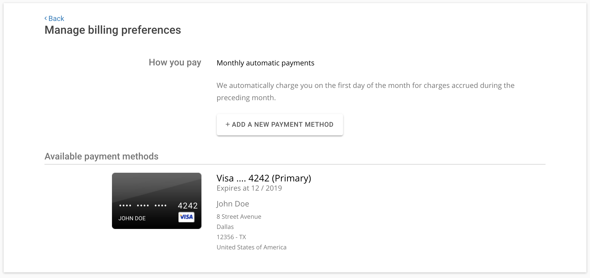

# Dashboard

When you click on manage under how you pay, you can see your current payment methods and you can add credit cards. Click on [Add a new payment method](../add/index.md) to add a new credit card.

