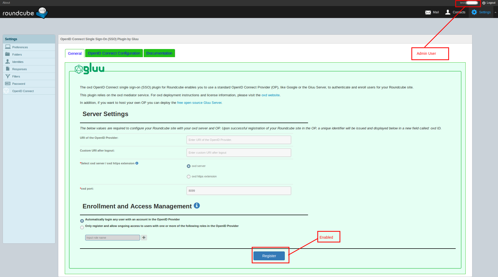
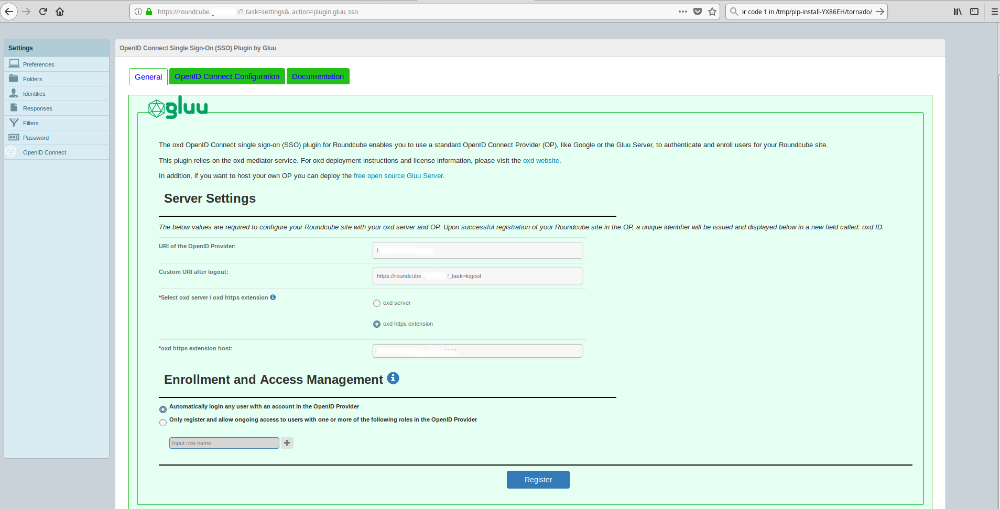
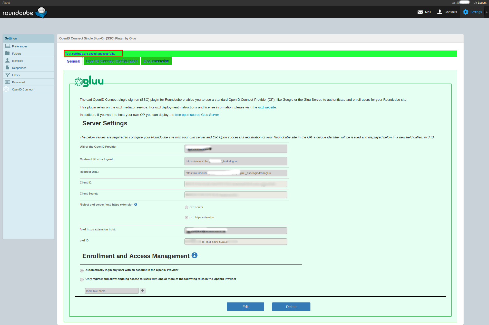
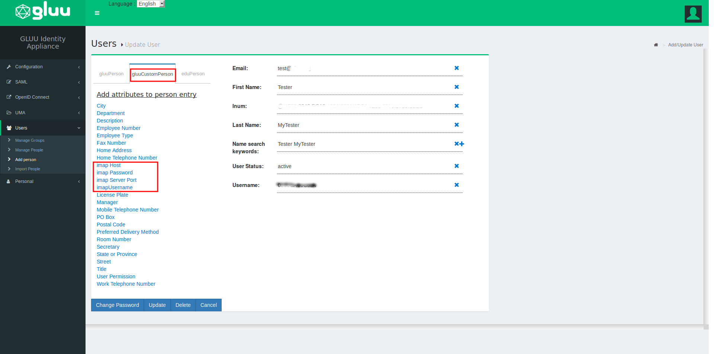

# RoundCube OpenID Connect Single Sign-On (SSO) Plugin By Gluu


Gluu's OpenID Connect Single Sign-On (SSO) Roundcube plugin will enable you to 
authenticate users against any standard OpenID Connect Provider (OP). If you don't already have an OP you can 
[deploy the free open source Gluu Server](https://gluu.org/docs/ce/3.1.3/installation-guide/install/).  

## Requirements
In order to use the RoundCube plugin you will need to have a standard OP (like Google or a Gluu Server) and the oxd server.

- [Gluu Server Installation Guide](https://gluu.org/docs/ce/3.1.3/installation-guide/install/)

- [oxd Server Installation Guide](https://oxd.gluu.org/docs/install/)


## Installation
 
### Manual Installation

To install the plugin manually, start by downloading the plugin from [Github source](https://github.com/GluuFederation/roundcube_oxd_plugin/archive/v3.1.1.zip). Right now, the manual installation is the best way to get the plugin working. The server we've used in our case is: https://roundcube.domain.com with latest roundcube installed which is of version 1.3.6. In our case, the directory which serves roundcube looks like: 

```
root@roundcube:~# ls -l /var/www/html/
total 16
-rw-r--r--  1 www-data www-data 11510 Dec 13  2017 index.html
lrwxrwxrwx  1 www-data www-data    33 Jul  3 18:27 roundcube -> /var/www/html/roundcubemail-1.3.6
drwxr-xr-x 13 www-data www-data  4096 Jul  3 21:03 roundcubemail-1.3.6
root@roundcube:~# 
```

For checking the directory in your case, please check your webserver configuration.


To download the plugin, run the command as:

```
wget https://github.com/GluuFederation/roundcube_oxd_plugin/archive/v3.1.1.zip
```

Once downloaded, unzip the archive as below:

```
unzip v3.1.1.zip 
```

Now, rename the resulting directory **roundcube_oxd_plugin-3.1.1** to **roundcube_oxd_plugin** as below:

```
mv roundcube_oxd_plugin-3.1.1/ roundcube_oxd_plugin
```


Next, move the plugin to the plugins directory of your roundcube installation. In our case, roundcube is installed under: **/var/www/html/roundcube**, so we'll move our plugin to **/var/www/html/roundcube/plugins** as below:

```
mv roundcube_oxd_plugin/ /var/www/html/roundcube/plugins/
```

In order to use this plugin, the plugin **roundcube_oxd_plugin** needs to be listed in the plugins list inside **config.inc.php** and in our case the file is: **/var/www/html/roundcube/config/config.inc.php**.

In our case, the earlier plugins array was as below:

> $config['plugins'] = array('acl', 'archive', 'attachment_reminder', 'emoticons', 'filesystem_attachments', 'managesieve', 'password');

We made it to look like:

> $config['plugins'] = array('acl', 'archive', 'attachment_reminder', 'emoticons', 'filesystem_attachments', 'managesieve', 'password', 'roundcube_oxd_plugin');


For those who want to view whole outputs, the collective output of operations carried out looks as below:

```
root@roundcube:~# wget https://github.com/GluuFederation/roundcube_oxd_plugin/archive/v3.1.1.zip
--2018-07-05 20:06:08--  https://github.com/GluuFederation/roundcube_oxd_plugin/archive/v3.1.1.zip
Resolving github.com (github.com)... 192.30.253.113, 192.30.253.112
Connecting to github.com (github.com)|192.30.253.113|:443... connected.
HTTP request sent, awaiting response... 302 Found
Location: https://codeload.github.com/GluuFederation/roundcube_oxd_plugin/zip/v3.1.1 [following]
--2018-07-05 20:06:08--  https://codeload.github.com/GluuFederation/roundcube_oxd_plugin/zip/v3.1.1
Resolving codeload.github.com (codeload.github.com)... 192.30.253.121, 192.30.253.120
Connecting to codeload.github.com (codeload.github.com)|192.30.253.121|:443... connected.
HTTP request sent, awaiting response... 200 OK
Length: 615078 (601K) [application/zip]
Saving to: ‘v3.1.1.zip’

100%[====================================================================================================================================================================================================>] 615,078     --.-K/s   in 0.04s   

2018-07-05 20:06:08 (14.5 MB/s) - ‘v3.1.1.zip’ saved [615078/615078]

root@roundcube:~# ls
v3.1.1.zip
root@roundcube:~# unzip v3.1.1.zip 
Archive:  v3.1.1.zip
6310435c0f410568ca2d765294a27e84c43651ad
   creating: roundcube_oxd_plugin-3.1.1/
 extracting: roundcube_oxd_plugin-3.1.1/.gitignore  
   creating: roundcube_oxd_plugin-3.1.1/GluuOxd_Openid/
   creating: roundcube_oxd_plugin-3.1.1/GluuOxd_Openid/css/
  inflating: roundcube_oxd_plugin-3.1.1/GluuOxd_Openid/css/bootstrap.css  
  inflating: roundcube_oxd_plugin-3.1.1/GluuOxd_Openid/css/gluu-oxd-css.css  
  inflating: roundcube_oxd_plugin-3.1.1/GluuOxd_Openid/css/gluu-oxd-css1.css  
   creating: roundcube_oxd_plugin-3.1.1/GluuOxd_Openid/fonts/
  inflating: roundcube_oxd_plugin-3.1.1/GluuOxd_Openid/fonts/glyphicons-halflings-regular.ttf  
  inflating: roundcube_oxd_plugin-3.1.1/GluuOxd_Openid/fonts/glyphicons-halflings-regular.woff  
 extracting: roundcube_oxd_plugin-3.1.1/GluuOxd_Openid/fonts/glyphicons-halflings-regular.woff2  
   creating: roundcube_oxd_plugin-3.1.1/GluuOxd_Openid/images/
   creating: roundcube_oxd_plugin-3.1.1/GluuOxd_Openid/images/icons/
  inflating: roundcube_oxd_plugin-3.1.1/GluuOxd_Openid/images/icons/gl.png  
   creating: roundcube_oxd_plugin-3.1.1/GluuOxd_Openid/js/
  inflating: roundcube_oxd_plugin-3.1.1/GluuOxd_Openid/js/jquery.min.js  
  inflating: roundcube_oxd_plugin-3.1.1/GluuOxd_Openid/js/scope-custom-script.js  
   creating: roundcube_oxd_plugin-3.1.1/GluuOxd_Openid/oxd-rp/
  inflating: roundcube_oxd_plugin-3.1.1/GluuOxd_Openid/oxd-rp/Client_OXD_RP.php  
  inflating: roundcube_oxd_plugin-3.1.1/GluuOxd_Openid/oxd-rp/Get_access_oken_by_refresh_token.php  
  inflating: roundcube_oxd_plugin-3.1.1/GluuOxd_Openid/oxd-rp/Get_authorization_url.php  
  inflating: roundcube_oxd_plugin-3.1.1/GluuOxd_Openid/oxd-rp/Get_client_access_token.php  
  inflating: roundcube_oxd_plugin-3.1.1/GluuOxd_Openid/oxd-rp/Get_tokens_by_code.php  
  inflating: roundcube_oxd_plugin-3.1.1/GluuOxd_Openid/oxd-rp/Get_user_info.php  
  inflating: roundcube_oxd_plugin-3.1.1/GluuOxd_Openid/oxd-rp/Logout.php  
  inflating: roundcube_oxd_plugin-3.1.1/GluuOxd_Openid/oxd-rp/Register_site.php  
  inflating: roundcube_oxd_plugin-3.1.1/GluuOxd_Openid/oxd-rp/Setup_client.php  
  inflating: roundcube_oxd_plugin-3.1.1/GluuOxd_Openid/oxd-rp/Update_site_registration.php  
  inflating: roundcube_oxd_plugin-3.1.1/README.md  
  inflating: roundcube_oxd_plugin-3.1.1/composer.json  
   creating: roundcube_oxd_plugin-3.1.1/docu/
  inflating: roundcube_oxd_plugin-3.1.1/docu/4.png  
  inflating: roundcube_oxd_plugin-3.1.1/docu/RoundCube2.png  
  inflating: roundcube_oxd_plugin-3.1.1/docu/gluusrv1.png  
  inflating: roundcube_oxd_plugin-3.1.1/docu/gluusrv2.png  
  inflating: roundcube_oxd_plugin-3.1.1/docu/rcopidlnk.png  
  inflating: roundcube_oxd_plugin-3.1.1/docu/rcregimg.png  
  inflating: roundcube_oxd_plugin-3.1.1/docu/rcscopdtl.png  
  inflating: roundcube_oxd_plugin-3.1.1/gluu_sso.js  
   creating: roundcube_oxd_plugin-3.1.1/localization/
  inflating: roundcube_oxd_plugin-3.1.1/localization/en_US.inc  
  inflating: roundcube_oxd_plugin-3.1.1/plugin.jpg  
  inflating: roundcube_oxd_plugin-3.1.1/roundcube.png  
  inflating: roundcube_oxd_plugin-3.1.1/roundcube_oxd_plugin.php  
   creating: roundcube_oxd_plugin-3.1.1/skins/
   creating: roundcube_oxd_plugin-3.1.1/skins/larry/
  inflating: roundcube_oxd_plugin-3.1.1/skins/larry/gluu_icon.png  
  inflating: roundcube_oxd_plugin-3.1.1/skins/larry/gluu_sso.css  


root@roundcube:~# ls
roundcube_oxd_plugin-3.1.1  v3.1.1.zip
root@roundcube:~# mv roundcube_oxd_plugin-3.1.1/ roundcube_oxd_plugin
root@roundcube:~# ls
roundcube_oxd_plugin  v3.1.1.zip
root@roundcube:~# 
root@roundcube:~# mv roundcube_oxd_plugin/ /var/www/html/roundcube/plugins/
root@roundcube:~# ls /var/www/html/roundcube/plugins
acl                         autologon             enigma                  hide_blockquote      jqueryui            newmail_notifier   redundant_attachments    subscriptions_option  virtuser_query
additional_message_headers  database_attachments  example_addressbook     http_authentication  krb_authentication  new_user_dialog    roundcube_oxd_plugin     userinfo              zipdownload
archive                     debug_logger          filesystem_attachments  identicon            managesieve         new_user_identity  show_additional_headers  vcard_attachments
attachment_reminder         emoticons             help                    identity_select      markasjunk          password           squirrelmail_usercopy    virtuser_file
root@roundcube:~# 
root@roundcube:~# grep plugins /var/www/html/roundcube/config/config.inc.php
// List of active plugins (in plugins/ directory)
$config['plugins'] = array('acl', 'archive', 'attachment_reminder', 'emoticons', 'filesystem_attachments', 'managesieve', 'password', 'roundcube_oxd_plugin');
```

This finishes, plugin installation process.


### Configuration

#### Roundcube Plugin Configuration
 
After clicking on Settings, in your RoundCube admin menu, you should see the OpenID Connect menu tab in the left pane towards the end. Click the link to navigate to the General configuration page. Please remember that only the admin users can register with the OpenID Provider(OP). For non-admin users, the registration is disabled. After installing the roundcube plugin, whichever user accesses the plugin first before configuration, becomes the admin user and can register the plugin to the OpenID provider. The other users can also be admin users and can carry out registration process.

!!! Note 
    Please note that only admin users can register the plugin to the OpenID Provider or edit the details. First user clicking on **OpenID Connect** link becomes the user.


Please note that, we've logged in with **test@domain.com**, this is the first ever user who clicks on **OpenID Connect** link in left pane. So, it becomes admin user. This user will find **Register** button **Enabled** as is evident from below screen-shot.



For our test, we're using below information:

| Resource       | Value   |
|----------------|---------|
| Users          | test@domain.com(admin user) and test1@domain.com(non-admin user)|
| OpenID Connect | https://idp.domain.com |
| OXD Server     | https://oxd-server.domain.com |
| Logout URL     | https://roundcube.domain.com/?_task=logout |

Above values are mandatory for making the client register to OpenID Provider.

Fill in the values from above table and click on **Register** for registring the client to OP. See how these values are filled as per screen-shot below:



Once the client registers successfully, it's assigned **Client ID** and **oxd ID**. Some values have been blurred for security reasons. This screen confirms that the client registered successfully. Below screen-shot confirms this.



The **OpenID Connect Configuration** values are shown in below screen-shot. New scopes can be added as desired by your configuration.


This part concludes the roundcube oxd plugin configuration side.


#### Registring Claims(Attributes) in OpenID Provider

Here we deal with the pre-requisites on OpenID Provider side. Four values aka **claims** are required for successful authentication to roundcube via oxd-service using OpenID Provider.
These are: **imapHost**, **imapPort**, **imapUsername** and **imapPassword**.

Below table defines these claims:

| Claim        | Description   |
|--------------|---------------|
| imapHost     | The name of imap service provider. We've used ssl://mail.domain.com. Since we intend to use 993 as imap port which supports ssl, so we're using ssl://. config.inc.php file of roundcube guides on more prefixes for imapHost. |
| imapPort     | The port at which the imap server serves you requests. Our port is 993 which stands for imaps. |
| imapUsername | For us, the imapusername is email id. We're using test@domain.com and test1@domain.com.|
| imapPassword | The imap Password for the user. It can be different from the OpenID Provider password for the user.|

!!!Note: 
    Please note that all the attribute values are case sensitive.

You can login to your OpenID Provider and see at: Configuration --> Attributes --> Show All Attributres. If these attributes do not exist or are not active, you can use below screen-shots as guidelines to create and register the attributes.

You can not add these attributes unless these exist in ldap of your OpenID Provider. For confirmation, please see if the below output is part of your OP. Path should be more or less similar.

```
root@idp.domain.com:~# cat /opt/gluu-server-3.1.3/opt/opendj/config/schema/77-customAttributes.ldif 
dn: cn=schema
objectClass: top
objectClass: ldapSubentry
objectClass: subschema
attributeTypes: ( 1486583426410 NAME 'imapPort' EQUALITY caseIgnoreMatch ORDERING caseIgnoreOrderingMatch SUBSTR caseIgnoreSubstringsMatch SYNTAX 1.3.6.1.4.1.1466.115.121.1.15 X-ORIGIN 'gluu' )
attributeTypes: ( 1486583381327 NAME 'imapUsername' EQUALITY caseIgnoreMatch ORDERING caseIgnoreOrderingMatch SUBSTR caseIgnoreSubstringsMatch SYNTAX 1.3.6.1.4.1.1466.115.121.1.15 X-ORIGIN 'gluu' )
attributeTypes: ( 1486403774573 NAME 'gluuPermission' EQUALITY caseIgnoreMatch ORDERING caseIgnoreOrderingMatch SUBSTR caseIgnoreSubstringsMatch SYNTAX 1.3.6.1.4.1.1466.115.121.1.15 X-ORIGIN 'gluu' )
attributeTypes: ( 1486583480345 NAME 'imapPassword' EQUALITY caseIgnoreMatch ORDERING caseIgnoreOrderingMatch SUBSTR caseIgnoreSubstringsMatch SYNTAX 1.3.6.1.4.1.1466.115.121.1.15 X-ORIGIN 'gluu' )
attributeTypes: ( 1486583825530 NAME 'imapData' EQUALITY caseIgnoreMatch ORDERING caseIgnoreOrderingMatch SUBSTR caseIgnoreSubstringsMatch SYNTAX 1.3.6.1.4.1.1466.115.121.1.15 X-ORIGIN 'gluu' )
attributeTypes: ( 1486583290517 NAME 'imapHost' EQUALITY caseIgnoreMatch ORDERING caseIgnoreOrderingMatch SUBSTR caseIgnoreSubstringsMatch SYNTAX 1.3.6.1.4.1.1466.115.121.1.15 X-ORIGIN 'gluu' )
attributeTypes: ( myCustomAttr1-oid NAME 'myCustomAttr1' EQUALITY caseIgnoreMatch SUBSTR caseIgnoreSubstringsMatch SYNTAX 1.3.6.1.4.1.1466.115.121.1.15 X-ORIGIN 'Gluu - dynamic registration custom attribute' )
attributeTypes: ( myCustomAttr2-oid NAME 'myCustomAttr2' EQUALITY caseIgnoreMatch SUBSTR caseIgnoreSubstringsMatch SYNTAX 1.3.6.1.4.1.1466.115.121.1.15 X-ORIGIN 'Gluu - dynamic registration custom attribute' )
objectClasses: ( 1.3.6.1.4.1.48710.1.4.101 NAME 'gluuCustomPerson' SUP top AUXILIARY MAY ( telephoneNumber $ mobile $ carLicense $ facsimileTelephoneNumber $ departmentNumber $ employeeType $ cn $ st $ manager $ street $ postOfficeBox $ employeeNumber $ preferredDeliveryMethod $ roomNumber $ secretary $ homePostalAddress $ l $ postalCode $ description $ title $ imapHost $ imapPort $ imapUsername $ imapPassword $ gluuPermission ) )
objectClasses: ( oxAuthClientCustomAttributes-oid NAME 'oxAuthClientCustomAttributes' SUP top AUXILIARY MAY ( myCustomAttr1 $ myCustomAttr2 ) )
root@idp.domain.com:~# 
```
Once confirmed that above attributes exist in ldap, you can move forward for adding the attributes from OP GUI.

For imapHost:


For imapPort:


For imapUsername:


For imapPassword:


#### Adding claims to scope

Once all the four attributes are registered and are active, you can create new scope named: **imapData** by going to **OpenID Connect** --> **Scopes** --> **Add Scope**. The name is exactly: **imapData**. After creating the scope, add the claims imapHost, imapPort, imapUsername, imapPassword to this newly created scope. Below screen-shot guides on this:


#### Adding attributes to users

Next for the two users, test@domain.com and test1@domain.com, add the newly created attributes(claims). Below screen-shot shows the available attributes which are created just now.



Similarly, add the attributes to other user test1@domain.com. Below we see how these attribute values look once we add these to the user profile test@domain.com:


### Further Information

1. Automatically log in any user with an account in the OpenID Provider: By setting login to automatic, any user with an account in the OP will be able to dynamically log in for an account in your Roundcube site 
1. Only register and allow ongoing access to users with one or more of the following roles in the OP: Using this option you can limit login to users who have a specified role in the OP, for instance `roundcube`. This is not configurable in all OPs, but is supported in the Gluu Server. [Follow the instructions below](#role-based-enrollment) to limit access based on an OP role 

If your OpenID Provider supports dynamic registration, no additional steps are required in the general tab and you can navigate to the [OpenID Connect Configuration](#openid-connect-configuration) tab. 

If your OpenID Connect Provider doesn't support dynamic registration, you will need to insert your OpenID Provider `client_id` and `client_secret` on the following page.

  

To generate your `client_id` and `client_secret` use the redirect URI: `https://{site-base-url}/index.php?option=oxdOpenId`.

!!!Note: 
    If you are using a Gluu server as your OpenID Provider, you can make sure everything is configured properly by logging into to your Gluu Server, navigate to the OpenID Connect > Clients page. Search for your `oxd id`.

#### Enrollment and Access Management

Navigate to your Gluu Server admin GUI. Click the `Users` tab in the left hand navigation menu. Select `Manage People`. Find the user(s) who should have access. Click their user entry. Add the `User Permission` attribute to the person and specify the same value as in the plugin. For instance, if in the plugin you have limited enrollment to user(s) with role = `roundcube`, then you should also have `User Permission` = `roundcube` in the user entry. Update the user record, and now they are ready for enrollment at your Roundcube site. 

### OpenID Connect Configuration

 

#### User Scopes

Scopes are groups of user attributes that are sent from the OP to the application during login and enrollment. By default, the requested scopes are `profile`, `imapData`, `email`, and `openid`.  

To view your OP's available scopes, in a web browser navigate to `https://OpenID-Provider/.well-known/openid-configuration`.  

If you are using a Gluu Server as your OpenID Provider, 
you can view all available scopes by navigating to the Scopes interface in Gluu CE Server Admin UI

`OpenID Connect` > `Scopes`  

In the plugin interface, you can enable, disable and delete scopes. 

!!!Note: 
    If you have chosen to limit enrollment to users with specific roles in the OP, you will also need to request the `Permission` scope, as shown in the above screenshot. 

### Attention

For logging into your RoundCube site, it is very important that your OP supports `imapData` scope, which contains your imap connection climes (`imapHost`,`imapPort`,`imapUsername`,`imapPassword`).
This is not configurable in all OP's. It is configurable if you are using a Gluu Server.
For example : `imapHost` = `ssl://imap.gmail.com` ; `imapPort` = `993` ; `imapUsername` = `username@gmail.com` ; `imapPassword` = `password` ; 

#### Authentication

##### Bypass the local RoundCube login page and send users straight to the OP for authentication

Check this box so that when users attempt to log in, they are sent straight to the OP, bypassing the local RoundCube login screen.
When it is not checked, it will give proof the following screen.   

 

##### Select ACR

To signal which type of authentication should be used, an OpenID Connect client may request a specific authentication context class reference value (a.k.a. "acr"). The authentication options available will depend on which types of mechanisms the OP has been configured to support. The Gluu Server supports the following authentication mechanisms out-of-the-box: username/password (basic), Duo Security, Super Gluu, and U2F tokens, like Yubikey.  

Navigate to your OpenID Provider configuration webpage `https://OpenID-Provider/.well-known/openid-configuration` to see supported `acr_values`. In the `Select acr` section of the plugin page, choose the mechanism which you want for authentication. 

!!!Note
    If the `Select acr` value is `none`, users will be sent to pass the OP's default authentication mechanism.
