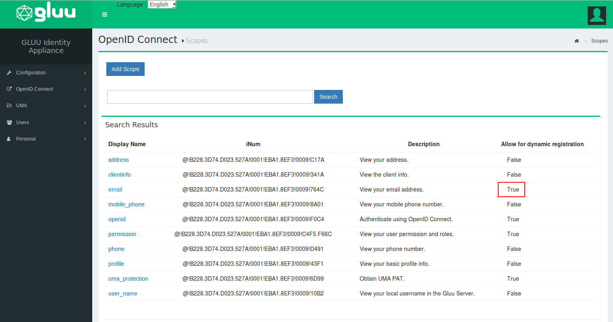

# SuiteCRM OpenID Connect Single Sign-On (SSO) Module By Gluu

The oxd OpenID Connect single sign-on (SSO) plugin for SuiteCRM enables you to use a standard 
OpenID Connect Provider (OP), like Google or the [Gluu Server](https://gluu.org/docs/ce/installation-guide/install/), 
to authenticate and enroll users for a SuiteCRM site. 

## SuiteCRM Demo Video
You can watch a video demo of the SuiteCRM plugin installation and configuration 
[here](https://youtu.be/1knNDIrKgLA). In the video we use a Google as the OpenID Provider.

## Requirements
In order to use the SuiteCRM module you will need
to have a SuiteCRM site, standard OP (like Google or a Gluu Server) and the oxd server.

- This plugin is compatible with SuiteCRM versions: 6.5 - 7.6

- If you want to stand up your own OP server, you can deploy the 
free open source [Gluu Server](https://gluu.org/docs/ce/3.1.3/installation-guide/install/). 
Otherwise we recommend using Google

- You will need a valid license to start the oxd server. You can get a license and a $50 credit 
by signing up on the [oxd website](https://oxd.gluu.org)

## Plugin Installation
 
### Download the Plugin
You can download the plugin from the [Github source](https://github.com/GluuFederation/suitecrm-oxd-module/blob/master/suitecrm-oxd-module.zip?raw=true)

### Upload Plugin
1. Open menu tab Admin and click on `Module loader` button
 
 

2. Choose downloaded module and click on `Upload` button. 
 

### Activate module
3. Click on `Install` button. 
 

4. Open menu tab OpenID Connect (SSO) Module by Gluu 
 

## Plugin Configuration
In your SuiteCRM admin dashboard you should now see the `OpenID Connect` link on the user drop-down menu.
Click the link to navigate to the General configuration page.

   
### General

#### Server Settings
In the server settings section of the plugin configuration page, you will need to enter 
information about your OP, your oxd server, and where you want to redirect users after logout. 

A short description of each field follows:

1. URI of the OpenID Provider: Insert the URI of the OpenID Connect Provider here. If you are using Google as your OP, this will simply be `https://accounts.google.com`. If you are using another OP it will be something like `https://idp.example.com` 

2. Custom URI after logout: Provide a URL for a landing page to redirect users after logout of the WP site, for instance `https://example.com/thank-you`. If you don't have a preferred logout page we recommend simply entering your website homepage URL. If you leave this field blank the user will see the default logout page presented by SuiteCRM 

3. oxd port: Enter the oxd-server port, which you can find in your `oxd-server/conf/oxd-conf.json` file

4. Click `Register` to continue
   
      - If your OpenID Provider supports dynamic registration no additional steps are required 
   
      - If your OpenID Connect Provider does not support dynamic registration (like Google), 
        after clicking register two additional fields will be exposed where you need to enter your `client_id` and `client_secret`. 
        Both values need to be obtained from the OP. To generate your `client_id` and `client_secret` use 
        the redirect uri: `https://{site-base-url}/index.php?option=oxdOpenId`

5. Add the following lines to the config_override.php in your SuiteCRM setup, after you complete the registration:
        
        $sugar_config['http_referer']['list'][] = your-openid-provider.uri`;
        $sugar_config['http_referer']['actions'] =array('index', 'ListView', 'DetailView', 'EditView', 'oauth', 'authorize', 
        'Authenticate', 'Login', 'SupportPortal', 'Wizard', 'index', 'ListView', 'DetailView', 'EditView', 'oauth', 'authorize',
        'Authenticate', 'Login', 'SupportPortal', 'SetTimezone' );
       
        $sugar_config['http_referer']['list'][]= {OpenID provider URI};
        
    For example: For Google it would be like below:

        $sugar_config['http_referer']['list'][]= accounts.google.com;
        
!!! Note
    If you are using a Gluu server as your OpenID Provider, you can make sure everything is configured properly by logging into to your     Gluu Server, navigate to the `OpenID Connect` > `Clients` page. Search for your `oxd id`. If it's present in the OP, everything worked.

#### Enrollment and Access Management
In the enrollment and access management section of the plugin configuration page you can decide, (1) how new user registrations will be handled, and (2) what role new users will receive upon registration.

- You have three options for new user registrations: 

  - Automatically register any user with an account in the OpenID Provider: By setting registration to automatic, any user with an account in the OP will be able to dynamically register for an account on your SuiteCRM site

  - Only register and allow ongoing access to users with one or more of the following roles in the OP: Using this option, you can limit registration to users that have a specified role in the OP, for instance `SuiteCRM`. Each time the user authenticates they will need to have this scope present in order to be approved for access (i.e. if you remove this scope from the users profile in the OP, the user would be denied access). This is not configurable in all OPs. It is configurable if you are using a Gluu Server. [Follow the instructions below](#role-based-enrollment) to limit access based on an OP role  

  - Disable automatic registration: If you choose to disable automatic registration, you will need to manually add a user in SuiteCRM for each person that needs access. Make sure that when you add the user in SuiteCRM, you use the same email they have registered in the OP 

- New User Default Role: Use this field to specify which role new users are assigned upon registration. If you have automatic registration set to disabled, you will have the opportunity to specify the users role during manual account creation 

##### Role Based Enrollment
In order to implement role based enrollment, you will need to make changes in both the plugin and the Gluu Server. 

**Perform the following in the Plugin:**     

1. In the Enrollment and Access Management section, choose the option: `Only register and allow ongoing...`   
1. Add a name for the role want to use to enforce access (e.g. `SuiteCRM` or `website`)     
1. Save the configuration
1. Navigate to the OpenID Connect Configuration tab  
1. In the User Scopes section, check the box for `permission`
1. Save your settings

**Perform the following in your Gluu Server:**    

1. Navigate to your Gluu Server admin GUI ("oxTrust") 
1. Click the `Users` tab in the left hand navigation menu 
1. Select `Manage People`  
1. Find the person(s) who should have access   
1. Click their user entry   
1. Add the `User Permission` attribute to the person and specify the same value as in the plugin. For instance, if in the plugin you specify that enrollment should be limited to users with role = `SuiteCRM`, then you should also have `User Permission` = `SuiteCRM` in the user entry. [See a screenshot example](../../img/plugin/suitecrm/suitecrm-ss.png)
1. Update the user record 

Now only users with the role `SuiteCRM` in the Gluu Server will be able to gain access to your SuiteCRM site. 

### OpenID Connect Configuration
Navigate to the OpenID Connect Configuration tab to set your preferences for scopes and authentication. 

#### User Scopes

Scopes are groups of user attributes that are sent from the OP to the application during login and enrollment. By default, the requested scopes are `profile`, `email`, and `openid`. If you want more information about the users, you can request additional scopes. 

To view your OP's available scopes, open a web browser and navigate to `https://<hostname>/.well-known/openid-configuration`. For example, if you are using Google as the OP, you can see the available scopes in the [Google's OP configuration](https://accounts.google.com/.well-known/openid-configuration). 

If you are using a Gluu server as your OpenID Provider, you can view available scopes by navigating to the OpenID Configuration page as described above, or within oxTrust by navigating to `OpenID Connect` > `Scopes`.

#### Authentication
In the authentication settings, you have two options:

- Bypass the local SuiteCRM login page and send users straight to the OP for authentication: 
  If you would like to bypass SuiteCRM's default login page and send users straight to the OP, check this box (**recommended**). 
  When this option is left unchecked users will see the following screen when trying to login: 

     

- Select ACR: `acr` is an OpenID Connect specific value that enables applications to request a 
  specific type of authentication from the OP, e.g. SMS based two factor authentication, or FIDO U2F tokens. 
  If you are using Google as your OP, you will have to accept their default authentication mechanism. 
  If you are using a Gluu Server, you will be able to request any supported form of authentication. 
  To view the OP's supported ACR values, navigate to your OpenID Provider configuration page, `https://<hostname>/.well-known/openid-configuration` and find `acr_values`. In the `Select acr` field you can choose your preferred authentication mechanism. If `Select acr` is `none`, users will be sent to pass the OPs default authentication mechanism.

## OP Configuration

### Gluu Server Configuration 

If you are using a Gluu Server as your OP, you will need to configure Gluu to release the email claim. You can do so by following the below steps:

1. Log in to your Gluu Server dashboard ("oxTrust") and navigate to `OpenID Connect` > `Scopes` 

2. Find the `email` scope and click on it 

3. Set the default scope field to `True`

4. If `Email` is not already added to the `Claims` field, click the `Add Claim`, search for email, and add it 

    

    

5. Now navigate to `Configuration` > `Attributes` and make sure that the `Email` attribute is set to `Active`. If it is not, click on the `email` attribute and scroll down to the `Status` field where you can change the value to Active. Click update  

    

### Google Configuration

To use Google as the OP, you will need to obtain a Client ID and Secret at Google. To generate your `client_id` and `client_secret` at Google use the redirect URI: `https://<hostname>/index.php?option=oxdOpenId`.

## Support
Please report technical issues and suspected bugs on our [support page](https://support.gluu.org). If you do not already have an account on Gluu Support, you can log in and create an account using the same credentials you created when you registered for your oxd license.
