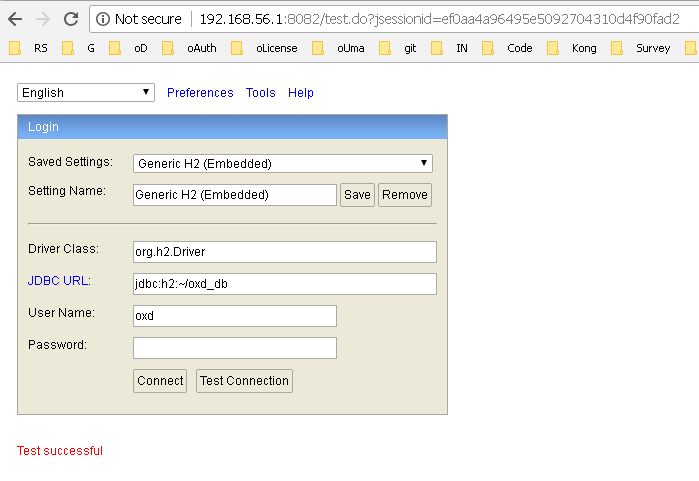

# Frequently Asked Questions (FAQ)

## General FAQs

### What is oxd?  
oxd is a mediator: it provides APIs that can be called by a web application more easily than directly calling the APIs of an OpenID Connect Provider (OP) or an UMA Authorization Server (AS).

### How is oxd licensed, and how much does it cost?       
oxd is commercially licensed software. To start the oxd server, a valid license is needed, which can be [obtained by registering on the oxd website](https://oxd.gluu.org). Each application (OAuth 2.0 client) that leverages the oxd service is billed USD $0.33 per day. Usage fees are accumulated daily and charged at the end of each month. If your organization needs annual billing, [schedule a call with us](https://gluu.org/booking).
 
### What types of applications can use oxd?       
Server-side web applications. 

### Where should oxd be deployed?      
By default, oxd-server must be deployed on the same host as the target web application(s). With the `oxd-https-extension` enabled, applications can call oxd over the web, enabling a central oxd service for many applications. 

### Can I use oxd for two-factor authentication (2FA)?**    
No. 2FA is implemented at the OP, not the client.  

### What are the support options?    
Gluu offers community support and VIP support. Anyone can register and enlist community support on the [Gluu support portal](https://support.gluu.org). For guaranteed responses and priority support, learn more about [VIP support](https://gluu.org/pricing). 

## Technical FAQs
### The `get_tokens_by_code` command fails with a `No response from operation` error

It can happen if `code` lifetime in `oxauth` server is very small and `code` expires before token can be obtained. So in logs, you can see this:

```
2018-04-05 14:30:32,530 ERROR [org.xdi.oxd.server.op.GetTokensByCodeOperation] Failed to get tokens because response code is: null
2018-04-05 14:30:32,530 ERROR [org.xdi.oxd.server.Processor] No response from operation. Command: Command{command=GET_TOKENS_BY_CODE, params={"code":"cc36672e-f8b9-4958-9a7c-3d83c99c4289","state":"us7d1v37cn1fcsd1c0156adr16","oxd_id":"055cec18-bd2e-4b29-ae38-7428d1d7c7fb","protection_access_token":"51ebfa51-d290-410e-bd37-abb3a0d8ab0c"}}
```

To fix it, increase the `authorizationCodeLifetime` oxauth configuration value as explained [here](https://gluu.org/docs/ce/3.1.3/admin-guide/oxtrust-ui/#oxauth-configuration).

### `oxd-https-extension` does not work because of a PROTECTION error.

If you see output in the logs similar to what is shown below, it means that the `uma_protection` scope is disabled for dynamic registration on the `oxauth` side.
Find the `uma_protection` Connect scope property `Allow for dynamic registration`, and make sure it is checked (set to true). Find more information about scopes [here](https://gluu.org/docs/ce/3.1.3/admin-guide/openid-connect/#scopes)
 
```
2018-04-04 20:03:24,855 ERROR [org.xdi.oxd.server.service.UmaTokenService] oxd requested scope PROTECTION but AS returned access_token without that scope, token scopes :openid
2018-04-04 20:03:24,855 ERROR [org.xdi.oxd.server.service.UmaTokenService] Please check AS(oxauth) configuration and make sure UMA scope (uma_protection) is enabled.
2018-04-04 20:03:24,855 TRACE [org.xdi.oxd.server.service.IntrospectionService] Exception during access token introspection.
java.lang.RuntimeException: oxd requested scope PROTECTION but AS returned access_token without that scope, token scopes :openid
	at org.xdi.oxd.server.service.UmaTokenService.obtainTokenWithClientCredentials(UmaTokenService.java:196)
	at org.xdi.oxd.server.service.UmaTokenService.obtainToken(UmaTokenService.java:169)
```

### How can I view data inside oxd database manually without oxd-server? 

By default oxd-server persists data inside H2 embedded database. On disk it should look as `oxd_db.mv.db` file.
You can use any convenient database viewer to view/edit data inside the database. We recommend use browser based viewer H2:

 - Download http://www.h2database.com/html/download.html
 - Run it (in "Platform-Independent zip" case it is as simple as hit `h2.sh` or `h2.bat`)
 
 In browser you will see connection details, please specify details as in `oxd-conf.json` file. 
 If all is filled correctly on "Test Connection" you should see "Test successful" message as on screenshot below.
 
 
 
 After hitting "Connect" button you will be able to view/modify data manually. Please be careful to not corrupt data inside otherwise oxd-server will not be albe to operate in normal mode. 
 
### Client expires, how can I avoid it?

`register_site` or `setup_client` commands generates client dynamically and thus those clients has lifetime set. Lifetime of the client is set on OP side.
It is possible to extend lifetime by calling `update_site` command and set `client_secret_expires_at` to the date which you wish. This field accepts number of milliseconds since 1970. You can use to [https://currentmillis.com/](https://currentmillis.com/) to convert date to milliseconds. For example `Fri Jun 15 2018 12:28:28` is `1529065708906`.
Note that `setup_client` creates 2 clients up to 3.2.0 oxd-server version, so if you need to extend lifetime of both clients you have to call `update_site` with `oxd_id` and `setup_client_oxd_id` which are returned as response from `setup_client` command. 

