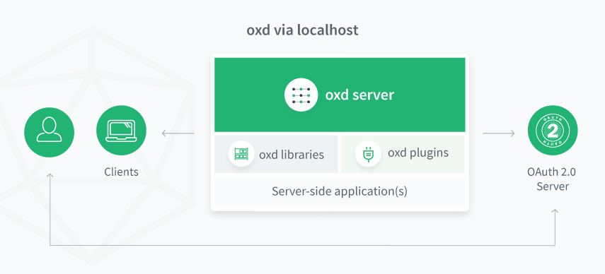

# oxd 3.1.3 Documentation

## Introduction
oxd exposes simple, static APIs for implementing user authentication and authorization against an OAuth 2.0 authorization server like [Gluu](https://gluu.org/docs/ce). By externalizing OAuth 2.0 code in a Linux package, oxd makes it easier to ensure and maintain secure, standards-based authentication and authorization across web applications. 

## Architecture 
The oxd Linux package includes the core `oxd-server` and the optional `oxd-https-extension`. Web applications can leverage the oxd APIs via localhost with the oxd-server, or over the web with the https-extension. 

### oxd-server
`oxd-server` is designed to work as a standalone service daemon via sockets. By default, oxd must be installed on the same host as the web application it is securing. 

 

### https-extension (optional)
When enabled, the https-extension enables secure communication to oxd APIs over the web, making it possible for many apps across many servers to leverage a central oxd service for OAuth 2.0 security.

 

## Benefits
oxd offers operational and security benefits for developers and organizations:

- oxd centralizes and standardizes OAuth 2.0 implementations across heterogenous application environments    
- When OAuth 2.0 vulnerabilities are discovered, simply update the oxd package--applications **never** have to be changed or regression tested    
- oxd is written, maintained and supported by OAuth 2.0 security experts   

## Get Started

Follow these steps to get started:

1. [Sign up](https://oxd.gluu.org/account/register/) to obtain your oxd license and $50 credit

1. [Install](./install/index.md) oxd on the same host as your application (or any host if enabling the HTTPS extension)

1. [Configure](./configuration/index.md) the `oxd-server` and add your license keys           

1. [Start](./install/index.md) the `oxd-server`, as described in the installation docs 

1. [Start and configure](./oxd-https/start/index.md) `oxd-https-extension` to support RESTful calls (**Optional**) 

1. In your app(s), call the [oxd API](#api) using one of the [native libraries](#native-libraries) or [oxd plugins](#plugins) to securely send users to the central authentication server for sign in 

## Compatibility
oxd 3.1.3 has been tested against the following OAuth 2.0 servers:

### OpenID Providers (OP)
- Gluu Server [3.1.3](https://gluu.org/docs/ce/3.1.3), [3.1.2](https://gluu.org/docs/ce/3.1.2), [3.1.1](https://gluu.org/docs/ce/3.1.1)
- [Google](https://developers.google.com/identity/protocols/OpenIDConnect)       

### UMA Authorization Servers (AS)
- Gluu Server [3.1.3](https://gluu.org/docs/ce/3.1.3), [3.1.2](https://gluu.org/docs/ce/3.1.2), [3.1.1](https://gluu.org/docs/ce/3.1.1)

!!! Note
    If you have successfully tested oxd against another OP or AS, please email details to [sales@gluu.org](mailto:sales@gluu.org).
    
## API
oxd implements the [OpenID Connect](http://openid.net/specs/openid-connect-core-1_0.html) and [UMA 2.0](https://docs.kantarainitiative.org/uma/wg/oauth-uma-grant-2.0-05.html) profiles of OAuth 2.0. 

- The [oxd OpenID Connect APIs](./api/index.md#openid-connect-authentication) can be used to send a user to an OpenID Connect Provider (OP) for authentication and to gather identity information ("claims") about the user. 

- The [oxd UMA APIs](./api/index.md#uma-2-authorization) can be used to send a user to an UMA Authorization Server (AS) for access management policy enforcement, for example to centrally manage which people (or software clients) can access which web pages and APIs.   

Learn more in the [oxd API section](./api/index.md) of the documentation.  

## Native Libraries
oxd native client libraries provide simple and flexible access to the oxd APIs. 

**Languages**:        

- [Python](./libraries/languages/python/index.md)         
- [Java](./libraries/languages/java/index.md)         
- [PHP](./libraries/languages/php/index.md)         
- [Node](./libraries/languages/node/index.md)          
- [C#](./libraries/languages/csharp/index.md)           

 
**Frameworks**:           

- [Java Spring](./libraries/framework/spring/index.md)  
- [Ruby on Rails](./libraries/framework/rails/index.md)      
- [Python Flask](./libraries/framework/flask/index.md)        
- [Node Express](./libraries/framework/express/index.md)       
- [.Net](./libraries/framework/net/index.md)        

## Plugins

Gluu currently publishes oxd plugins, modules, and extensions for the following open source applications:    

- [Wordpress](./plugin/wordpress/index.md)      
- [Magento](./plugin/magento/index.md)       
- [Drupal](./plugin/drupal/index.md)       
- [OpenCart](./plugin/opencart/index.md)       
- [SuiteCRM](./plugin/suitecrm/index.md)       
- [SugarCRM](./plugin/sugarcrm/index.md)       
- [Roundcube](./plugin/roundcube/index.md)  
- [NextCloud](./plugin/nextcloud/index.md) 

Gluu does not guarantee specific functionality in oxd plugins. If you find a bug or need feature enhancements, just open a ticket on [Gluu support](https://support.gluu.org).  

## Source code
The oxd source code is [available on GitHub](https://github.com/GluuFederation/oxd). 

## Pricing & Billing

oxd costs **USD $0.33 per application ("OAuth 2.0 client") per day**. All new accounts include up to 10 clients free forever.   

[Get your oxd license](https://oxd.gluu.org).

Additional notes about pricing and billing: 

- Each time a new OAuth2 client connects to your `oxd-server`, a record is created and you will be charged USD $0.33 each day the application remains active  

- At the end of each month usage fees are compiled and a billing summary is sent to all users associated with your account   

- On the 7th day of each month we will attempt to bill your credit card for usage fees incurred during the previous month

- If the transaction is declined, or there is no credit card on file, your oxd installation(s) will be deactivated and the sign-in process will stop working for applications that leverage your inactive oxd server  

- To discuss volume discounts and site licenses, [schedule a call](https://gluu.org/booking) 
   
!!! Note
    Do you want to use oxd with an open source project? Gluu is happy to provide free oxd licenses to qualified open source projects. Send an email to [sales@gluu.org](mailto:sales@gluu.org). 
   
## Support
Gluu offers free community support for oxd on the [Gluu Support Portal](https://support.gluu.org). You can log into the support site using the same credentials that you use to access the oxd license management app (and vice versa). In fact, we use oxd and a Gluu Server to provide single sign-on across our oxd portal and support app! 

If your organization needs guaranteed response times, private support, and priority access to our support and development team, Gluu offers a range of [VIP support plans](https://gluu.org/pricing). You can [schedule a meeting](https://gluu.org/booking) with us to discuss and move forward with purchasing a support contract.  

## FAQ

**What is oxd?**       
oxd is a mediator: it provides APIs that can be called by a web application that are easier than directly calling the API's of an OpenID Connect Provider (OP) or an UMA Authorization Server (AS).

**How is oxd licensed, and how much does it cost?**        
oxd is commercially licensed software. To start the oxd server you will need a valid license, which you can [obtain for free by registering on the oxd website](https://oxd.gluu.org). For each application that leverages your oxd service, you will be charged USD $0.33 per day. So for example, if you have 10 applications leveraging your oxd server, you will be charged USD $3.30 per day. Usage fees are accumulated daily and billed at the end of each month. If you need a site license for oxd, [schedule a call](https://gluu.org/booking).
 
**What types of applications can use oxd?**        
oxd only supports server-side web applications. If you are using the Gluu Server as your OP and need single sign-on (SSO) to single-page apps (SPAs), native apps, or SaaS apps, please review the Gluu Server [SSO integration guide](https://gluu.org/docs/ce/integration/).  

**What is the oxd-server?**       
oxd-server is a standalone service with socket connection. By default it's restricted to localhost (`localhost_only: true` configuration in `oxd-conf.json`). It's possible to turn off this restriction if you set `localhost_only: false` in `oxd-conf.json`.

**What is the oxd-https-extension?**       
oxd-https-extension is a RESTful Jetty based server which accepts HTTP calls and redirects them to the `oxd-server`. If you want to connect apps to your oxd server via `HTTPS`, you can simply [start the oxd-https-extension](./oxd-https/start/index.md) after deploying and configuring your oxd-server. 

**Where do I deploy oxd-server?**      
By default, the oxd-server must be deployed on the same server as the web application(s) you want to protect. However, with the `oxd-https-extension` running, you can deploy a central, robust oxd service on dedicated server(s).

**Why should I use oxd?**     
oxd offers a few key improvements over the traditional model of embedding OAuth 2.0 code in your applications:

1. If new vulnerabilities are discovered in OAuth2/OpenID Connect, oxd is the only component that needs to be updated. The oxd APIs remain the same, so you don't have to change and regression test your applications     

2. oxd is written, maintained, and supported by developers who specialize in application security. Because of the complexity of the standards--and the liability associated with poor implementations--it makes sense to rely on professionals who have read the specifications in their entirety and understand how to properly implement the protocols     

3. Centralization reduces costs. By using oxd across your IT infrastructure for application security (as opposed to a handful of homegrown and third party OAuth2 client implementations), the surface area for vulnerabilities, issue resolution, and support is significantly reduced. Plus, you who have someone to call if something goes wrong!     

**Which programming languages and frameworks does oxd have libraries for?**        
There are oxd libraries for many popular programming languages and frameworks. [See above](#native-libraries). 

**How do I get SSO across several websites?**                
You’ll need two things:     

1. A central OpenID Connect Provider (OP) that holds the passwords and user information  

2. Websites that use the OpenID Connect protocol to authenticate users

An easy way to accomplish the first--install and configure the [free open source Gluu Server](http://gluu.org/docs/ce) using the Linux packages for CentOS, Ubuntu, Debian or Red Hat. Or you can also utilize Google as your OpenID Connect Provider (OP). The second is accomplished by calling the oxd APIs in your applications to send users to the OP for login. 

**Can I use oxd plugins for social login?**    
oxd simply makes it easy to send users to an OpenID Connect Provider (OP) for login. If you want to offer users the option to use social login, that needs to be implemented at the OP. If you are using the Gluu Server as your OP, you can use [Passport.js](https://gluu.org/docs/ce/authn-guide/passport/) to configure and support social login. 

**Can I use oxd for two-factor authentication (2FA)?**    
Again, since oxd simply makes it easy to send users to an OpenID Connect Provider (OP) for login, two-factor authentication needs to be enforced at the OP. If you are using the Gluu Server as your OP, there are several built in two-factor authentication mechanisms. Learn more in the [Gluu Server authentication guide](https://gluu.org/docs/ce/3.1.3/authn-guide/intro/).

**Can I use Google or Microsoft Azure Active Directory as my OpenID Connect Provider?**    
We have tested and confirmed oxd to work with Google as an OP. Microsoft's OP implementation is not totally standard though, and therefore may require changes or updates to oxd to work. 

**Can I purchase support for the Gluu Server or oxd?**    
Yes, for information on paid support, [visit our website](http://gluu.org/pricing).

