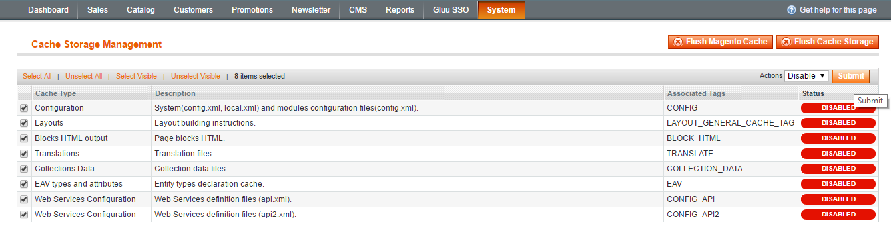
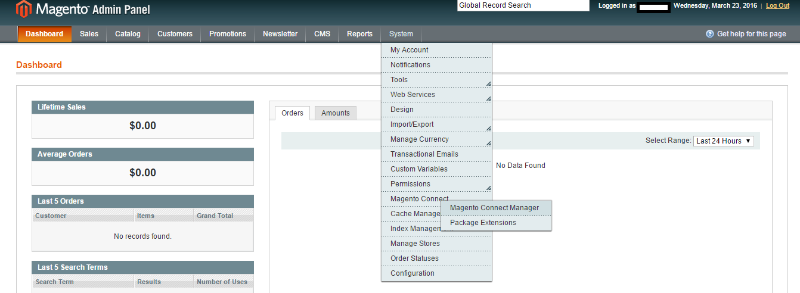
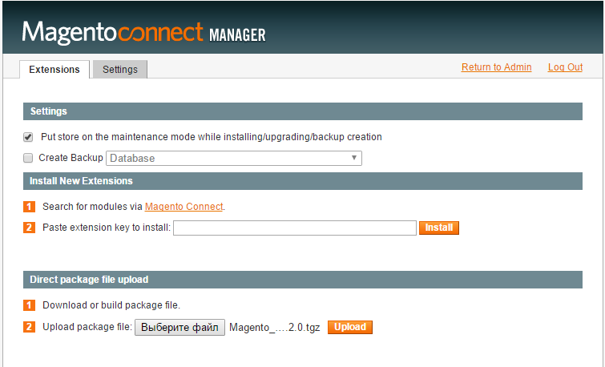
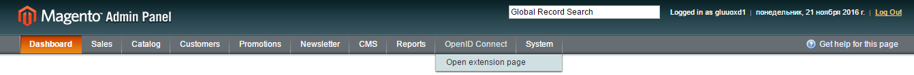
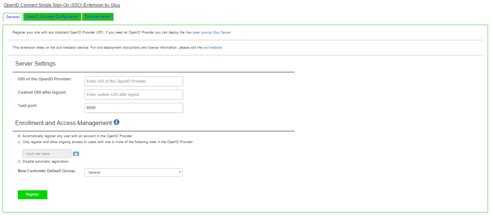
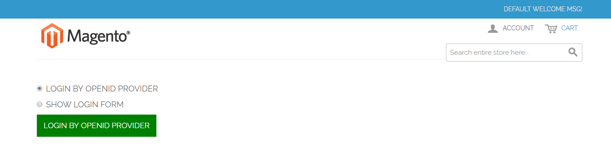
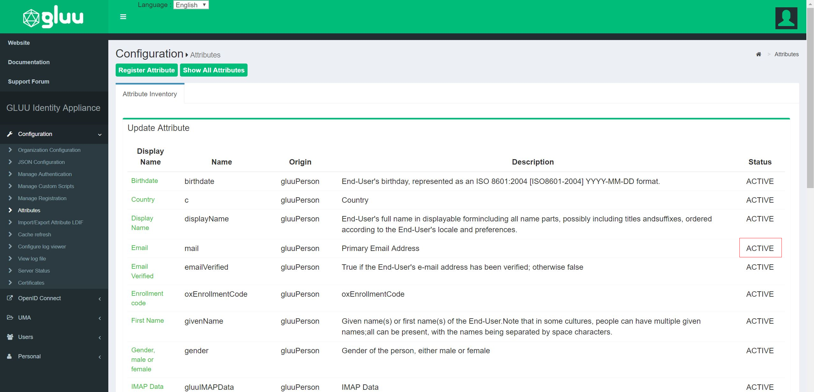

# OpenID Connect Single Sign-On (SSO) Magento Extension By Gluu

The oxd OpenID Connect single sign-on (SSO) plugin for Magento enables you to use a standard 
OpenID Connect Provider (OP), like Google or the [Gluu Server](https://gluu.org/docs/ce/installation-guide/install/), 
to authenticate and enroll users for a Magento site. 

## Magento Demo Video

You can watch a video demo of the Magento plugin installation and configuration 
[here](https://youtu.be/2gXPMUsLOfU). In the video we use a Gluu Server as the OpenID Provider. 

## Requirements
In order to use the Magento Extension, you will need a Magento site,
standard OP (like Google or a Gluu Server) and an active oxd server.

- This plugin is compatible with Magento versions: 1.5 - 1.9.2

- If you prefer to have your own OP server, you can deploy the free open source 
[Gluu Server](https://gluu.org/docs/ce/3.1.3/installation-guide/install/). Otherwise we recommend using Google

- You will need a valid license to start the oxd server. You can get a license and a $50 credit by 
signing up on the [oxd website](https://oxd.gluu.org)

## Plugin Installation
 
### Download the Plugin

You can either download Magento Plugin from the [Github source](https://github.com/GluuFederation/magento-oxd-extension/blob/master/Magento_gluu_SSO-3.0.1.tgz)
or [Magento marketplace](https://www.magentocommerce.com/magento-connect/openid-connect-sso.html).

### Disable cache
To Install Magento plugin, you have to disable cache in Magento Admin console

1. Log into Magento Admin Panel and in the menu click on `System` > `Cache Management`

    

2. Check `select all` option to select all cache type and set `Action` drop down menu to disable and 
click on submit button
   
    

### Upload Plugin

1. Log in to Magento Admin Panel and navigate to `System` > `Magento Connect` > `Magento Connect Manager`

    

2. Select the downloaded plugin file and click on upload button

    

3. When the extension is successfully installed, return to the admin panel

    !!! Note:
        The extension will be activated automatically.

4. Log into Magento Admin Panel and navigate to `OpenID Connect` > `Open extension page`

    

## Plugin Configuration 

In your Magento admin dashboard, you should now see the OpenID Connect tab in the left-hand menu. 
Click the link to navigate to the General configuration page.

### General
In your Magento admin menu panel, you should now see the OpenID Connect menu tab being displayed. 

Click the link to navigate to the General configuration page:

 
 
#### Server Settings
In the server settings section of the plugin configuration page you will need to enter 
some information about your OP, your oxd server, and where you want to redirect users after logout. 

A short description of each field follows:

1. URI of the OpenID Provider: Provide the URI of the OpenID Connect Provider here. 
If you are using Google as your OP, this will simply be `https://accounts.google.com`. 
If you are using another OP it will be something like `https://idp.example.com` 

2. Custom URI after logout: Provide a URL for a landing page to redirect users after logout of the magento site, for instance `https://example.com/thank-you`. 
If you don't have a preferred logout page, we recommend simply entering the URL of your website homepage URL. 
If you leave this field blank the user will see the default logout page presented by Magento 

3. oxd port: Enter the oxd-server port, which you can find in your `oxd-server/conf/oxd-conf.json` file

4. Click `Register` to continue

If your OpenID Provider supports dynamic registration no additional steps are required. 

If your OpenID Connect Provider does not support dynamic registration (like Google), 
after clicking register two additional fields will be exposed where you need to enter 
your `client_id` and `client_secret`. 

Both values need to be obtained from the OP. To generate your `client_id` and `client_secret` 
use the redirect URI: `https://{site-base-url}/index.php?option=oxdOpenId`.

!!! Note
    If you are using a Gluu server as your OpenID Provider, you can make sure everything is 
    configured properly by logging into to your 
    Gluu Server, navigate to the `OpenID Connect` > `Clients` page. Search for your `oxd id`. 
    If you are able to find your oxd ID in OP, everything worked.

#### Enrollment and Access Management
In the enrollment and access management section of the plugin configuration page you can decide, 
(1), how new user registration will be handled, and, (2), what role new users will receive upon registration.

- You have three options for how new user registrations are handled: 

  - Automatically register any user with an account in the OpenID Provider: By setting registration to automatic, any user with an account in the OP will be able to dynamically register for an account on your Magento site

  - Only register and allow ongoing access to users with one or more of the following roles in the OP: Using this option, you can limit registration to users that have a specified role in the OP, for instance `magento`. Note: this is not configurable in all OP's. It is configurable if you are using a Gluu Server. [Follow the instructions below](#role-based-enrollment) to limit access based on an OP role. Each time the user authenticates they will need to have this scope present in order to be approved for access (i.e. if you remove this scope from the users profile in the OP, the user would be denied access) 

  - Disable automatic registration: If you choose to disable automatic registration, you will need to manually add a user in magento for each person you want to have access. Make sure that when you add the user in magento, you use the same email that they have registered in the OP 

- New User Default Role: Use this field to specify which role to give to new users upon registration. If you have automatic registration set to disabled, you will have the opportunity to specify the users role during manual account creation 

##### Role Based Enrollment
In order to implement role based enrollment, you will need to make changes in both the plugin and the Gluu Server. 

**Perform the following in the Plugin:**     

1. In the Enrollment and Access Management section, choose the option: `Only register and allow ongoing...`   
1. Add a name for the role want to use to enforce access (e.g. `magento` or `website`)     
1. Save the configuration
1. Navigate to the OpenID Connect Configuration tab  
1. In the User Scopes section, check the box for `permission`
1. Save your settings

**Perform the following in your Gluu Server:**    

1. Navigate to your Gluu Server admin GUI ("oxTrust") 
1. Click the `Users` tab in the left hand navigation menu 
1. Select `Manage People`  
1. Find the person(s) who should have access   
1. Click their user entry   
1. Add the `User Permission` attribute to the person and specify the same value as in the plugin. For instance, if in the plugin you specify that enrollment should be limited to users with role = `magento`, then you should also have `User Permission` = `Magento` in the user entry. [See a screenshot example](../../img/plugin/magento-users.png)
1. Update the user record  

Now, only users with the role `Magento` in the Gluu Server will be able to gain access to your magento site. 

### OpenID Connect Configuration
Navigate to the OpenID Connect Configuration tab to set your preferences for scopes and authentication. 

#### User Scopes

Scopes are groups of user attributes that are sent from the OP to the application during login and enrollment. By default, the requested scopes are `profile`, `email`, and `openid`. If you want more information about the users, you can request additional scopes. 

To view your OP's available scopes, open a web browser and navigate to `https://<hostname>/.well-known/openid-configuration`. For example, if you are using Google the the OP, you can see the available scopes in the [Google's OP configuration](https://accounts.google.com/.well-known/openid-configuration). 

If you are using a Gluu server as your OpenID Provider, you can view available scopes by navigating to the OpenID Configuration page as described above, or within oxTrust by navigating to `OpenID Connect` > `Scopes`.

#### Authentication
In the authentication settings, you have two options:

- Bypass the local Magento login page and send users straight to the OP for authentication: 
If you would like to bypass Magento's default login page and send users straight to the OP, 
check this box (**recommended**). When this option is left unchecked users will see the following screen 
when trying to login: 

 

- Select ACR: `acr` is an OpenID Connect specific value that enables applications to request a 
specific type of authentication from the OP, e.g. SMS based two factor authentication, or FIDO U2F tokens. 
If you are using Google as your OP, you will have to accept their default authentication mechanism. 
If you are using a Gluu Sever, you will be able to request any supported form of authentication. 
To view the OP's supported ACR values, navigate to your OpenID Provider 
configuration page, `https://<hostname>/.well-known/openid-configuration` and 
find `acr_values`. In the `Select acr` field you can choose your preferred authentication 
mechanism. If `Select acr` is `none`, users will be sent to pass the OP's default authentication mechanism.

## OP Configuration

### Gluu Server Configuration 

If you are using a Gluu Server as your OP, you will need to configure Gluu to release the email claim. 
You can do so by following the below steps:

1. Log in to your Gluu Server dashboard ("oxTrust") and navigate to `OpenID Connect` > `Scopes` 

2. Find the `email` scope and click on it 

3. Set the default scope field to `True`

4. If `Email` is not already added to the `Claims` field, click the `Add Claim`, search for email, and add it  

5. Now navigate to `Configuration` > `Attributes` and make sure that the `Email` attribute is set to `Active`. If it is not, click on the `email` attribute and scroll down to the `Status` field where you can change the value to Active. Click update 

### Google Configuration

To use Google as the OP, you will need to obtain a Client ID and Secret at Google. 
To generate your `client_id` and `client_secret` at Google use 
the redirect uri: `https://<hostname>/index.php?option=oxdOpenId`.

## Support
If you are having any technical issue on using Gluu's OpenID Connect Single Sign-On (SSO) 
Magento Plugin you can check our support page or raise support ticket at [https://support.gluu.org](https://support.gluu.org)
