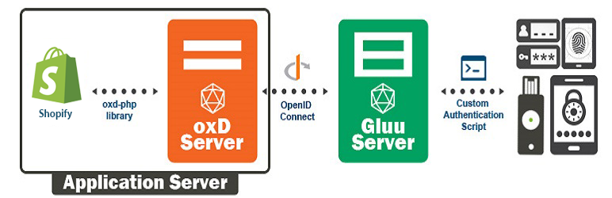
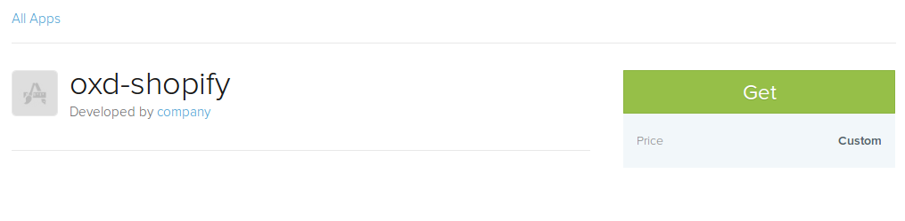
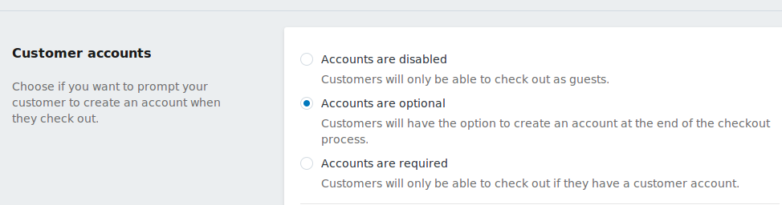

# OpenID Connect Single Sign-On (SSO) Shopify App By Gluu

Gluu's OpenID Connect Single Sign-On (SSO) Shopify App will enable you to 
authenticate users against any standard OpenID Connect Provider (OP). 
If you don't already have an OP you can use Google or 
[deploy the free open source Gluu Server](https://gluu.org/docs/ce/installation-guide/install/).  

## Requirements
In order to use the Shopify App, you will need a standard OP (like Google or a Gluu Server) and the oxd server.

* [Gluu Server Installation Guide](https://gluu.org/docs/ce/installation-guide/install/).

* [oxd Webpage](https://oxd.gluu.org)

## Installation
 
### Download

You can download the Shopify Plugin from [Github Source](https://github.com/GluuFederation/shopify-oxd-plugin)

### Upload
Open your Shopify App Page, e.g. `https://apps.shopify.com/oxd-shopify`, click on the Get and install in any store.

 

### Activate 

App Automatic Redirect To Plugin Settings:
 
Go to `https://{storename}/admin/settings/checkout` to enable the option to enable the login page. (An account is optional.)
Then you can see the login page in Shopify:

## Configuration

### General
 
In your Shopify app store on the frontend login page, you see the button to login with the Gluu Server:

 

Click on the login button with Gluu Server. iFrame will open and log into the Gluu Server. It will automatically create an account on Shopify.
