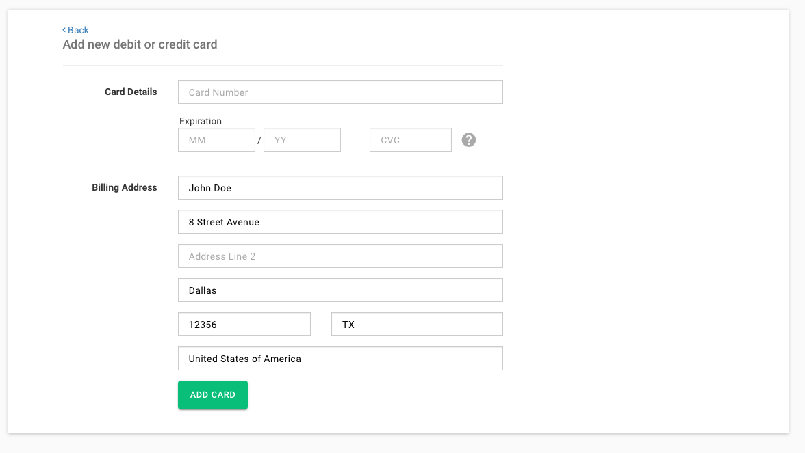

# Payments

To add a credit card, enter your card number, expiry date and cvc, and confirm you billing address. If your card is valid it will be added to your payment methods and you will be redirected to your [credit card list](../dashboard/index.md).

