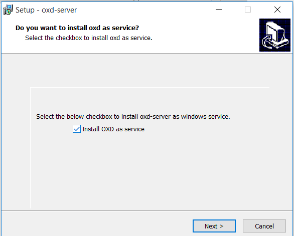
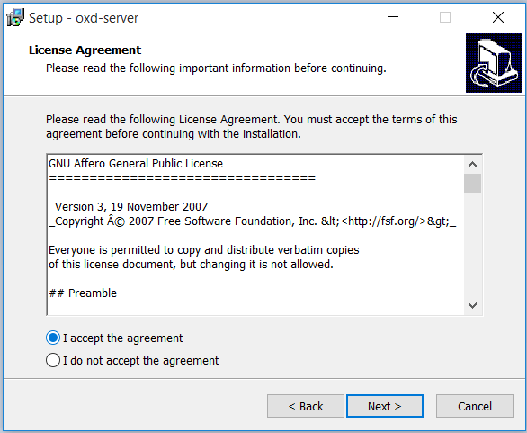
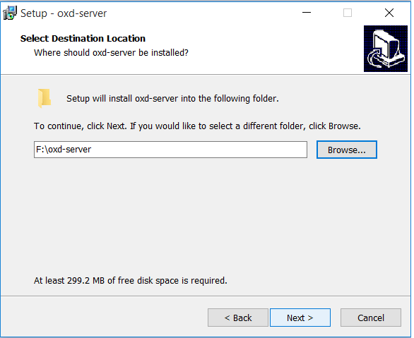
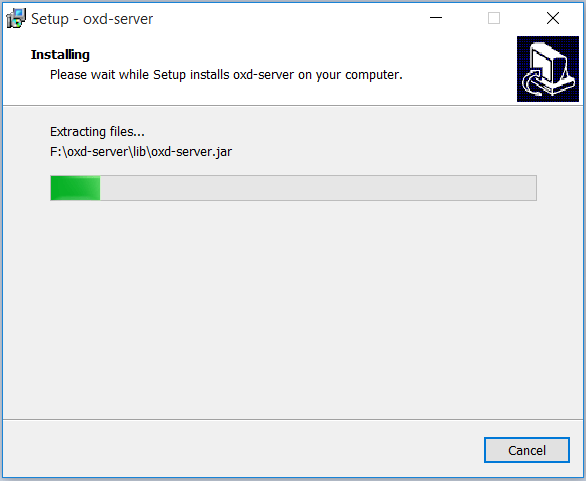
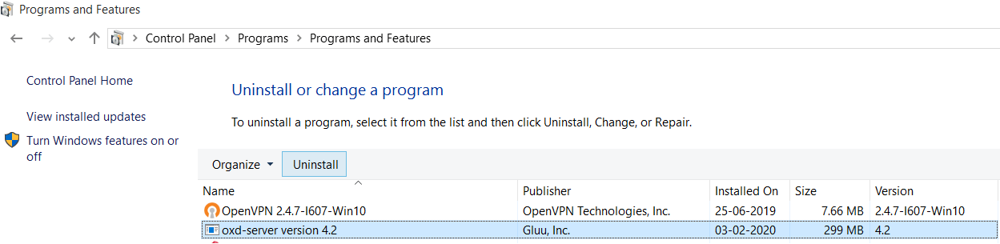

# oxd as windows service

This tutorial covers the steps involved to generate the EXE file for the installation of oxd-server as service on Windows operating system.

## How to generate oxd windows executable installation file (`oxd-server.exe`)?

The important point to be noted here is that the EXE file can be only generated in windows OS. oxd team is working further so that in upcoming oxd release windows executable installation file can also be generated in Linux OS.

#### Prerequisites

1. Windows OS

   We can generate EXE only on Windows OS.

1. JRE 8+

   Install [JRE](https://www.oracle.com/technetwork/java/javase/downloads/jre8-downloads-2133155.html) version 8 or higher. Set `JRE_HOME` environment variable on windows.

1. Inno Setup

   Download and install [Inno Setup](http://www.jrsoftware.org/isdl.php) on Windows OS. Set `INNOSETUP_HOME` environment variable pointing to the home folder of Inno Setup installation (eg: `C:\Program Files (x86)\Inno Setup 5`).

#### Steps to generate EXE

1. Clone oxd project from [Github](https://github.com/GluuFederation/oxd)

   If you have `git` installed, just open a console and run below command to clone the project.
   ```
   git clone https://github.com/GluuFederation/oxd.git
   ```
1. Issue the below command to build oxd project
   ```
    mvn clean install -Dmaven.test.skip=true -P windows-build
   ```
   Depending on connection speed and computer performance, it may take a couple of minutes to download all required dependencies and build the project.

1. Extract `oxd-server-distribution.zip` generated in `${OXD_HOME}/oxd-server/target` folder. Change directory to the `bin` folder inside the extracted zip file.

1. Double click on `oxd-create-win-service-exe.bat` file and this will generate `oxd-server.exe` outside `bin` folder.

### oxd installation using EXE file

1. To install oxd using EXE file double click on `oxd-server.exe`.

1. During installation first page that will appear will ask whether oxd should be installed as windows service or not. Select the checkbox to install `oxd as service`.

   

1. The second page will have license agreement which need to accepted before moving forward.

   

1. The final page will allow user to select installation directory of oxd server.

   
   
If installed as `windows service` then the oxd server will start automatically after the windows machine is started and there is no need to start oxd manually.

   
   
### oxd uninstall

1. The installed oxd can be uninstalled from `Control Pannel--> Programs-->Uninstall a program`.

   

2. oxd can be also uninstalled using `unins000.exe` file inside oxd installation directory (eg: `D:\softwares\oxd-server\unins000.exe`).

